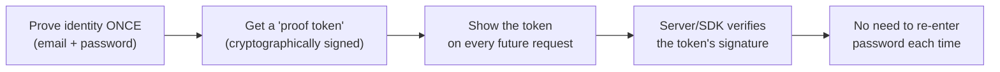
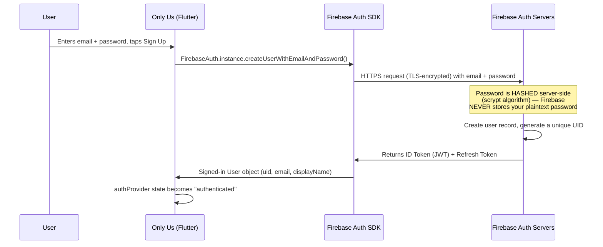
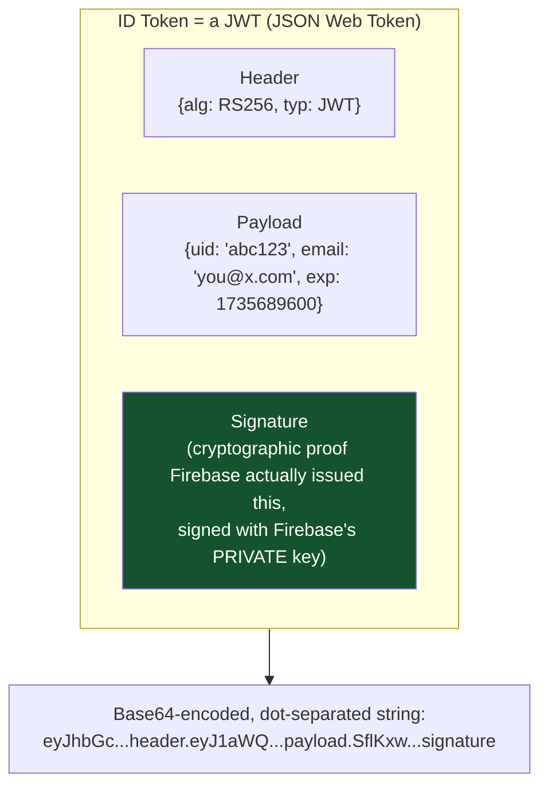
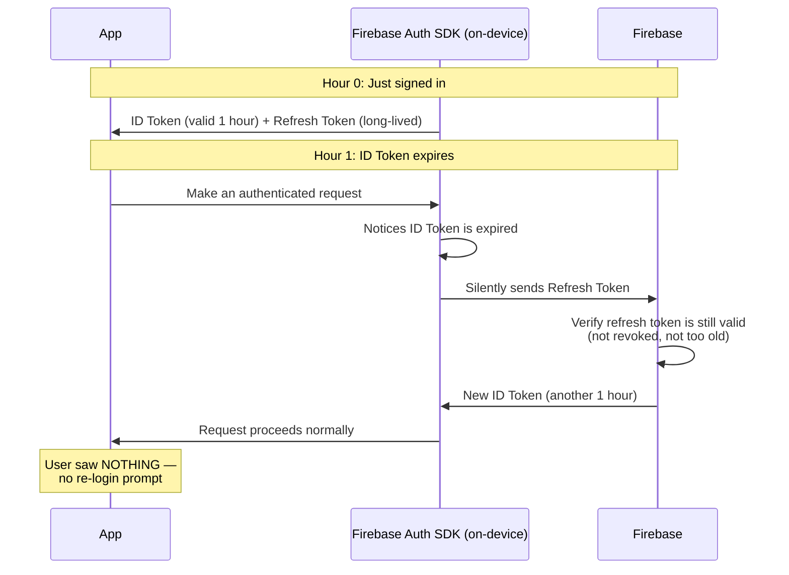
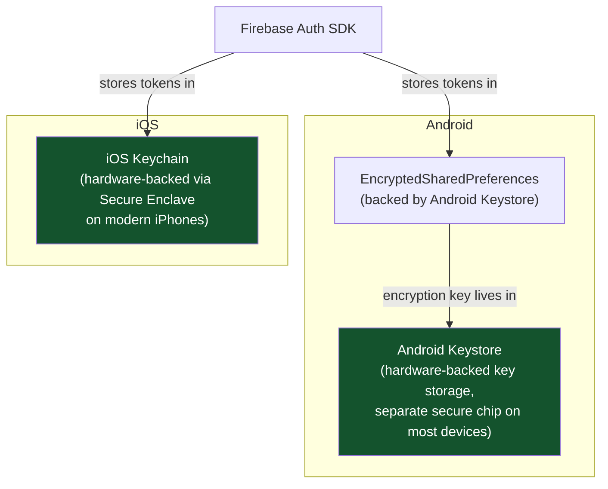
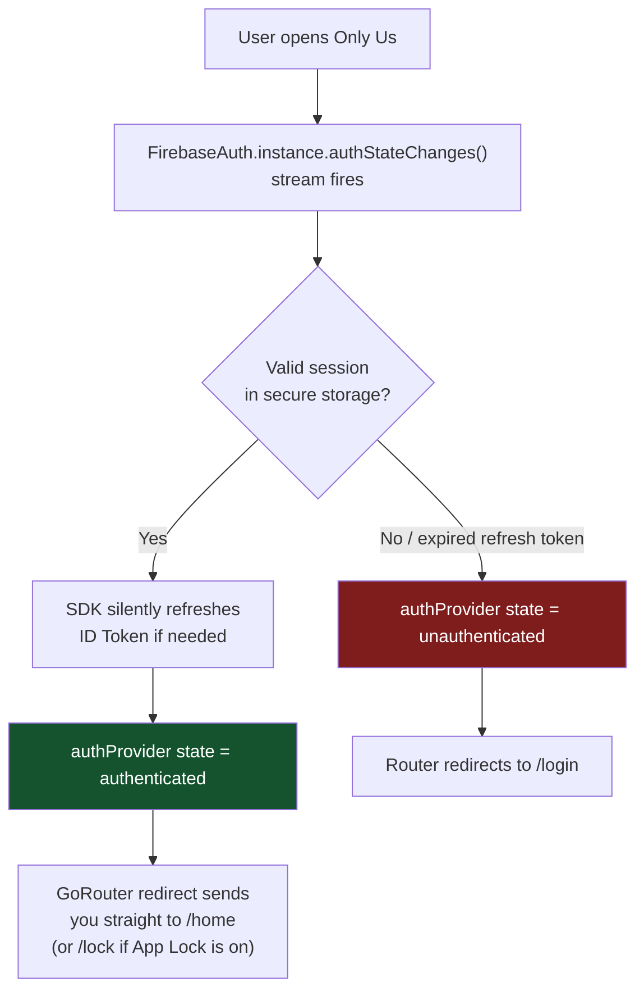
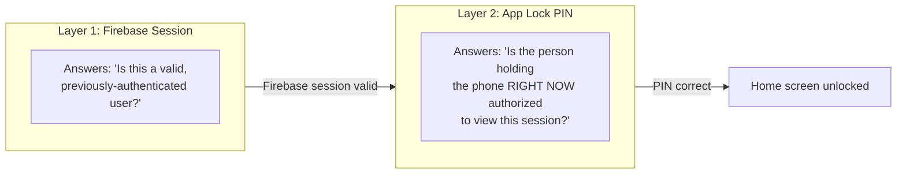

# Authentication — Deep Dive (Beginner to Low-Level)

How "logging in" actually works, from the moment you type a password to why you don't have to type it again tomorrow. Grounded in this app's real Firebase Auth implementation.

---

## 1. The Core Problem Authentication Solves

Your app needs to answer one question forever: **"Is the person using this app right now actually who they claim to be?"**

You can't ask this question on every single tap (imagine re-entering your password every time you open a chat) — so auth systems are built around **proving identity once, then remembering that proof** for a while.



---

## 2. What Happens the Moment You Tap "Sign Up"



**Critical detail — your password never touches your own database.** In `lib/features/auth/presentation/providers/auth_provider.dart`, the app calls `FirebaseAuth.instance.createUserWithEmailAndPassword(email, password)`. That password travels over an encrypted HTTPS connection straight to Firebase's Auth servers, gets hashed there using **scrypt** (a slow, memory-hard hashing algorithm specifically designed to resist brute-force attacks), and only the hash is stored. Even Firebase's own engineers can't recover your original password from that hash.

---

## 3. What Is a "Token" — The Actual Proof of Identity

This is the concept most beginners get fuzzy on. Let's be precise.



**Why can't you just fake one?** The signature is created using Firebase's **private key**, which only Firebase holds. Anyone verifying the token uses Firebase's matching **public key** to check the signature — if you tampered with the payload (e.g., changed `uid` to someone else's), the signature check fails instantly. This is the same asymmetric cryptography (public/private key pairs) that secures HTTPS itself.

**The ID Token has a short lifespan — exactly 1 hour.** After that, it's considered expired and rejected by anything that checks it.

---

## 4. Why You Don't Have to Log In Every Time (The Refresh Token)

If the ID Token dies after 1 hour, how does the app avoid asking you to log in hourly? A second token — the **Refresh Token** — solves this.



**This refresh cycle is entirely automatic** — the Firebase SDK inside your app handles it in the background. You, the developer, never manually refresh tokens; `FirebaseAuth.instance.currentUser` just keeps working.

**The Refresh Token itself doesn't expire on a fixed schedule** — it stays valid until one of these happens:
- The user explicitly signs out (`signOut()` — see `auth_provider.dart`)
- The refresh token is revoked (e.g., you changed your password, or an admin/security event forces re-auth)
- Firebase detects the token hasn't been used in a very long time (months of inactivity) and Google's infrastructure eventually invalidates old, unused sessions
- The user uninstalls and reinstalls the app (the token lived in that installation's storage, which gets wiped)

**This answers your exact question**: there is no fixed "log in again after X days" timer in this app's current setup — sessions persist indefinitely across app restarts until you explicitly sign out, or an inactivity/security-driven revocation happens on Google's side (which isn't on a documented fixed timer for client apps — it's closer to "if literally unused for an extremely long time").

---

## 5. Where Are These Tokens *Actually* Stored on Your Phone?

This is the low-level part. The Firebase Auth SDK persists your session using **platform-native secure storage** — not a plain text file you could just open and read.



**Why this matters:** these aren't just "app files" — they're encrypted using keys tied to secure hardware (Android Keystore / iOS Secure Enclave) that **cannot be extracted even with root/jailbreak access** on modern, patched devices. This is the exact same storage mechanism this app's own `flutter_secure_storage` package uses for the App Lock PIN hash (see Guide 2) — Firebase Auth's SDK does the equivalent thing internally for your session tokens.

**Compare to a bad, naive approach** (NOT what this app does):
```
❌ Storing tokens in: SharedPreferences (Android) plaintext XML file
❌ Storing tokens in: a SQLite database with no encryption
❌ Storing tokens in: app's regular Documents folder as a .txt file
```
Any of those could be read by anyone with root access or a backup-extraction tool. The Keystore/Keychain approach specifically defeats that.

---

## 6. The Full Picture — Every Time You Open the App



**In this app's code** (`lib/features/auth/presentation/providers/auth_provider.dart` + `lib/core/router/app_router.dart`): the `AuthNotifier` listens to Firebase's `authStateChanges()` stream at app startup. This stream automatically emits the current user (or `null`) based on what's in secure storage — the app never manually checks "is there a saved token file somewhere?" It just asks Firebase's SDK, which handles all of Section 5's complexity invisibly.

---

## 7. App Lock (PIN) Is a *Separate* Layer From This

Important distinction beginners miss: **Firebase session persistence** (this document) and **this app's PIN-based App Lock** (see Guide 2) are two independent systems.



You could be validly signed into Firebase (session never expired) but still get stopped at the PIN screen every time you reopen the app — because App Lock's "unlocked" state deliberately resets on every cold start (`sessionUnlockedProvider` in `app_lock_provider.dart`), regardless of how long your Firebase session has left. These are intentionally decoupled: one proves *who you are* (long-lived), the other proves *you're physically present right now* (resets constantly, by design).

---

## Glossary

- **JWT (JSON Web Token)** — a signed, tamper-evident token format used to prove identity claims
- **ID Token** — short-lived (1hr) proof of identity, sent with authenticated requests
- **Refresh Token** — long-lived credential used to silently obtain new ID Tokens without re-entering a password
- **scrypt** — a deliberately slow password-hashing algorithm resistant to brute-force/GPU cracking
- **Android Keystore / iOS Keychain/Secure Enclave** — hardware-backed secure storage for cryptographic keys, resistant to extraction even on a rooted/jailbroken device
- **Session revocation** — invalidating a refresh token early (e.g. after a password change), forcing re-login
