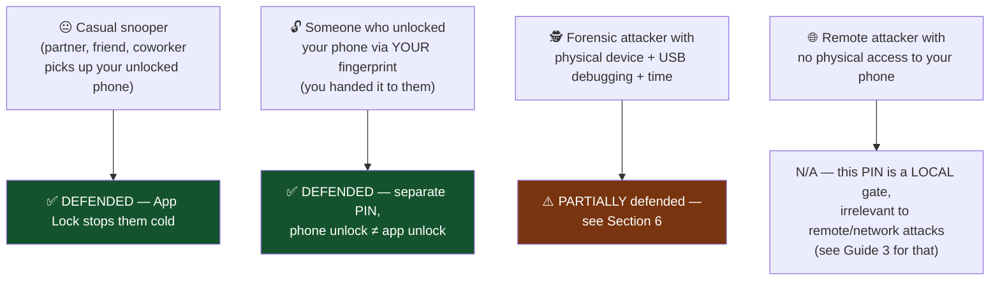
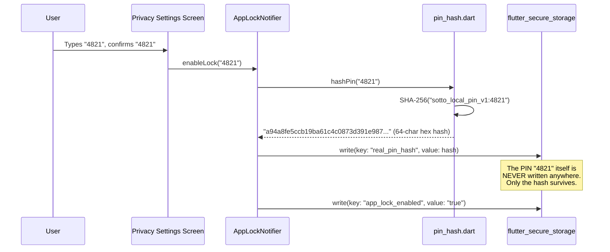
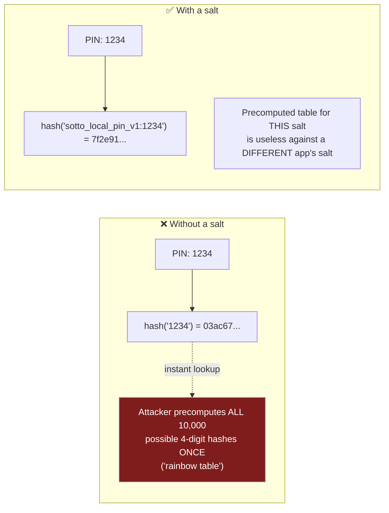
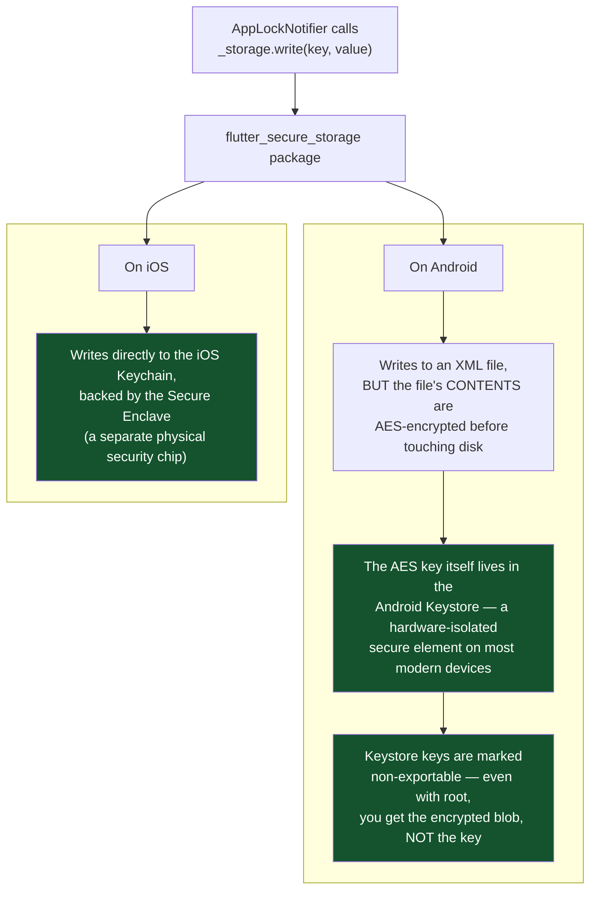
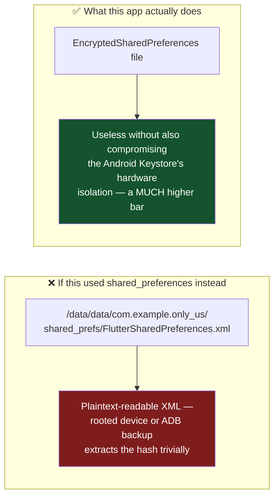
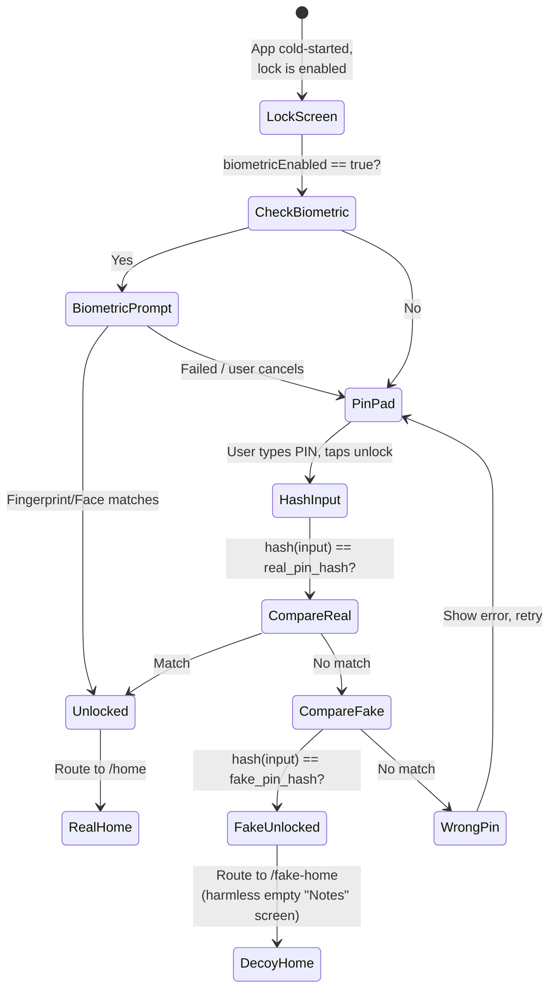
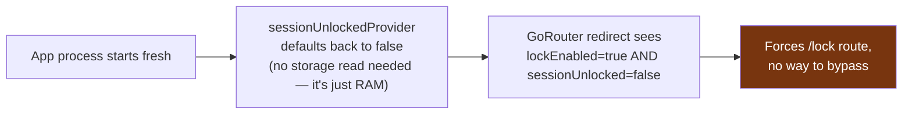
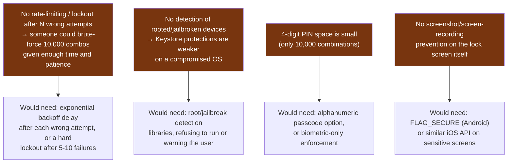

# App PIN (App Lock) — Deep Dive (Mobile Security Perspective)

How this app's 4-digit PIN gate actually protects you, exactly where every byte of it lives on disk, and — just as important — what it does **not** protect against. Grounded in the real implementation: `lib/core/security/app_lock_provider.dart` and `lib/core/security/pin_hash.dart`.

---

## 1. The Threat Model — What Is This PIN Actually Defending Against?

Before designing any security feature, you must ask: **defending against whom, doing what?** Get this wrong and you build the wrong protection.



**This app's PIN is a "shoulder-surfing / casual-access" defense**, not a defense against a determined attacker with your unlocked device and forensic tools. That's a normal, honest scope for a local app lock — same category as Signal's or WhatsApp's own app-lock features.

---

## 2. What Happens the Instant You Type a PIN to Set It Up



**The actual line of code that matters most in this whole feature:**
```dart
String hashPin(String pin) => sha256.convert(utf8.encode('$_salt:$pin')).toString();
```

This is a **one-way function** — you can go from `"4821"` → `"a94a8fe5..."` easily, but there is no way to reverse `"a94a8fe5..."` back into `"4821"`. That's the entire point of hashing: the app can *check* if a PIN is correct (by hashing what you just typed and comparing) without ever needing to *store* the real PIN anywhere, including in memory for longer than a function call.

---

## 3. Why a "Salt" (and Why This App's Salt Choice Is a Deliberate, Reasoned Tradeoff)



A salt's real job is normally to make one **shared, leaked password database** (think: a hacked website with millions of users) resistant to a single precomputed rainbow table attacking every user's hash at once — usually via a **unique salt per user**.

**This app deliberately uses one fixed, shared salt** (`sotto_local_pin_v1`) instead of a per-user random one — and the code says exactly why, in a comment:

```dart
// ponytail: fixed salt is fine for a local device PIN gate (not a
// server-side credential) — the threat model is "someone picks up the
// phone", not "someone steals a password database".
```

This is **correct reasoning, not laziness** — because unlike a web app's password database with millions of hashes in one place, this hash lives **only on your one device**, in secure storage (Section 4). There's no "database" to steal in bulk. An attacker who already has your phone's secure storage contents has already won regardless of salting strategy — salting defends against a *different* attack (mass database leaks) that structurally doesn't apply here.

---

## 4. Where Does the Hash Actually Live? (The Part Most Tutorials Skip)



**This is the single most important security decision in this feature** — and it's why `flutter_secure_storage` was chosen over `shared_preferences` (which the app *does* use elsewhere, e.g. for the branding name/logo choice, but deliberately never for anything security-sensitive).



---

## 5. Unlock Flow — Real PIN vs Fake PIN vs Biometric



**The Fake PIN is a genuine security/privacy pattern, not a gimmick** — it's the same category of feature as a "duress code" in physical security systems. If someone forces you to unlock the app (a partner demanding to see it, a border search, etc.), entering the fake PIN opens a harmless decoy screen with **no path back to the real app** — you have to fully close and reopen the app and enter the *real* PIN to get back in. The person watching you unlock it sees a normal-looking "Notes" app and has no way to know a real, hidden app exists behind a different code.

**Look closely at `verifyPin()`** — it checks the real PIN *first*, and only falls through to the fake PIN check if the real one doesn't match. This ordering matters: it means even if someone knew both codes existed, they can't distinguish "real PIN entered" from "fake PIN entered" by timing alone in any meaningful way (both paths do one hash comparison; the difference is negligible and not something a phone-holding attacker could measure without lab equipment).

---

## 6. Session Unlock State — Why You're Asked for the PIN on *Every* Cold Start

```dart
final sessionUnlockedProvider = StateProvider<bool>((ref) => false);
```

This is a plain in-memory Riverpod state — **not persisted to storage at all**. Every time the app process is killed and restarted (see Guide 1's OS process lifecycle discussion, or the earlier Mobile Architecture guide), this resets to `false` automatically, simply because it's RAM-only state that never survives a process death.



This is a deliberate design choice: **the PIN gate should re-trigger every time the app is freshly launched**, precisely because "the app was just opened" is exactly the moment someone else might be holding the phone. Persisting "already unlocked" across restarts would defeat the entire point.

---

## 7. What This PIN Feature Does *Not* Protect Against (Being Honest About Limits)



None of these are bugs — they're scope boundaries any real app has to draw somewhere. Knowing exactly where your app's protections stop is itself a core security skill; pretending a feature protects against everything is how false confidence leads to real breaches.

---

## Glossary

- **Hash function** — a one-way mathematical function that turns input into a fixed-length output; cannot be reversed
- **SHA-256** — a specific, widely-used cryptographic hash function producing a 256-bit (64 hex character) output
- **Salt** — extra data mixed into a hash to defend against precomputed lookup-table attacks (rainbow tables)
- **Android Keystore / iOS Secure Enclave** — hardware-isolated key storage; keys inside are non-exportable even to the OS itself
- **Duress code / Fake PIN** — a second valid unlock code that opens a decoy instead of the real content, for use under coercion
- **Rainbow table** — a precomputed table mapping common inputs to their hash outputs, used to reverse unsalted hashes quickly
- **Cold start** — launching an app from a fully-terminated process state (see Mobile Architecture guide)
