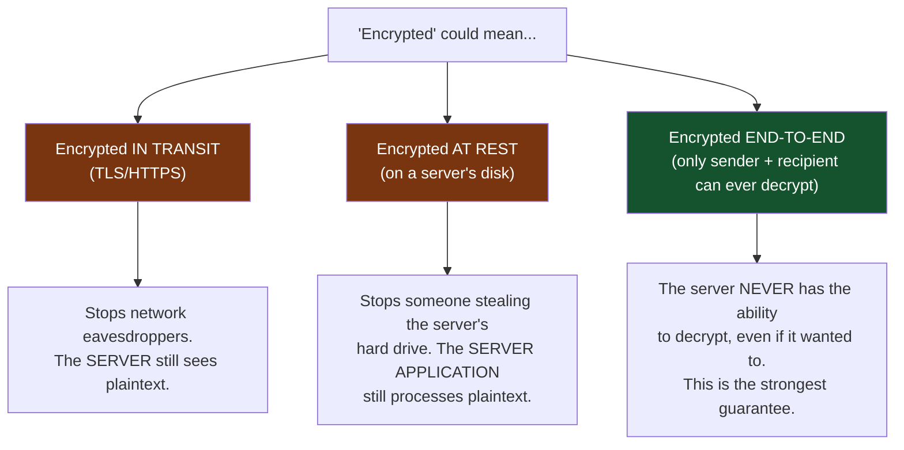
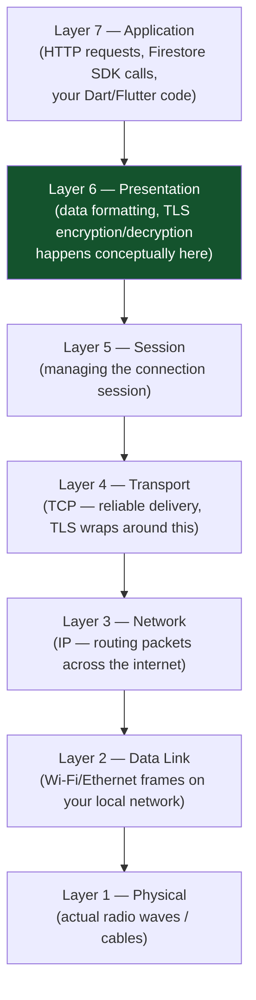
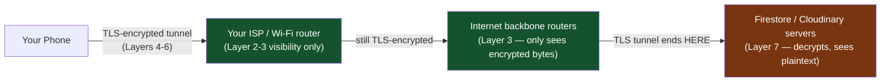
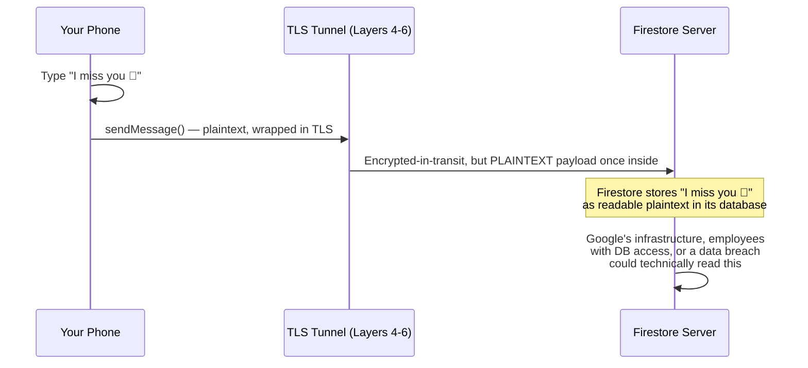
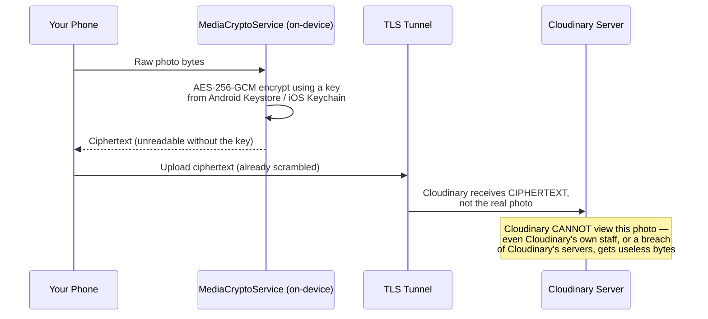
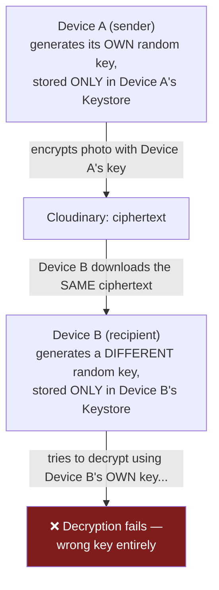
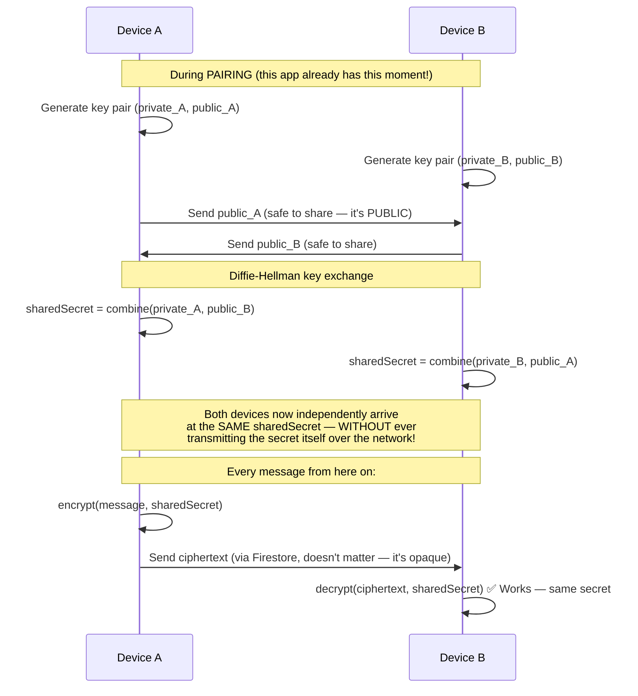
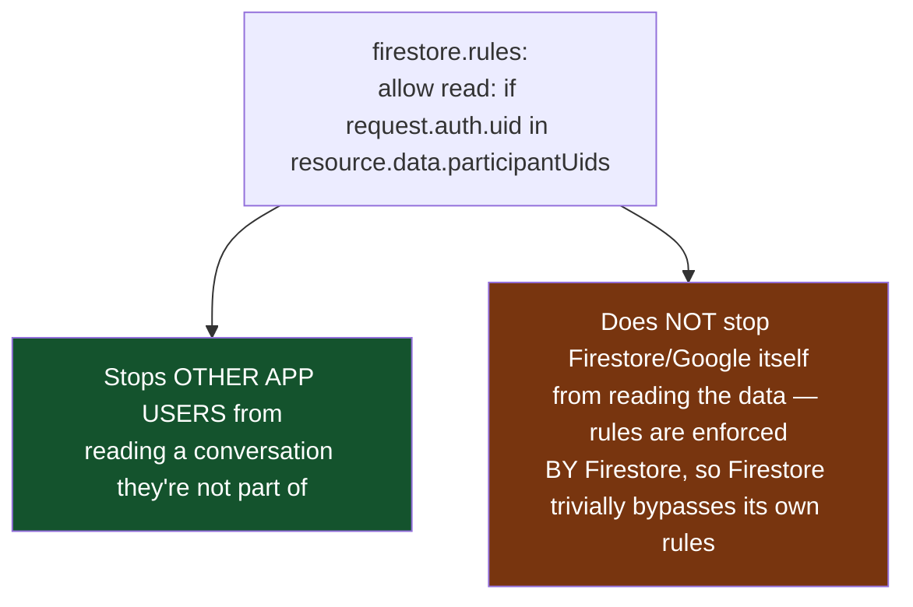

# Message Encryption & the OSI 7 Layers — Deep Dive

**Read this one carefully — it contains an honest correction of what this app's "Encrypted" badge actually means today versus what true end-to-end encryption requires.** Understanding the gap is more valuable than a comforting but inaccurate summary.

---

## 1. First, What Does "No One Can See It" Actually Require?

There's a critical distinction almost every beginner (and a lot of production apps' marketing) blurs:

**Only (D) actually answers "no one in the network or internet layer — or the server itself — can see it."** (B) and (C) are real, valuable protections, but they explicitly do NOT stop the server/cloud provider from reading your data — because the server holds the decryption key (or never needed one, since it just sees plaintext over an encrypted pipe).

---

## 2. The OSI 7-Layer Model — Where Does Encryption Actually Happen?

**TLS (what makes HTTP become HTTPS) operates around Layers 4-6** — it wraps your Layer 7 application data in an encrypted tunnel before it's broken into TCP packets and routed across the internet. This is why:

**Everyone between your phone and Google/Cloudinary's servers — your ISP, any Wi-Fi network operator, anyone doing packet-sniffing on public Wi-Fi, any router in between — sees only encrypted TLS bytes.** This is genuinely strong protection against network-layer eavesdroppers, and this app gets it **automatically for free**, because `cloud_firestore` and `http` (used for Cloudinary) both use HTTPS by default. You didn't have to write any code for this part — it's baked into the SDKs.

**But TLS decryption happens AT the server.** Firestore's servers, and Cloudinary's servers, see your data in plaintext the instant it arrives — that's simply how TLS termination works. This is not a flaw in this app; it's how virtually all cloud services work, including WhatsApp's server infrastructure for metadata, delivery receipts, etc. The question is: **what data actually reaches those servers as plaintext, and what arrives already scrambled before TLS even starts?**

---

## 3. Where This App Actually Stands Today — Text Messages

**Honest fact: text messages in this app's real chat (`RemoteChatService.sendMessage`) are NOT end-to-end encrypted.** They travel over TLS (safe from network eavesdroppers) but are stored as **plaintext** in Firestore. The "Encrypted" badge shown in the chat header (`_ChatHeader`/`_RemoteChatHeader`'s "🔒 Encrypted · Active quietly" text) is, for text messages, describing the *transport* encryption (TLS) that basically every app on the internet has — not a stronger end-to-end guarantee. This is documented plainly in this project's own README as "aspirational UI, not a security claim" for exactly this reason.

---

## 4. Where This App Actually Stands Today — Photo Messages (Closer, But Not Quite There Either)

Photos go through a real extra step text messages don't:

**This part is genuinely stronger than text messages** — the photo is scrambled *before* it ever leaves your device, so Cloudinary structurally cannot see it, regardless of TLS. This is real client-side encryption.

### But here's the gap you specifically asked me to be honest about:

**Look at `MediaCryptoService._loadOrCreateKey()`**: it generates one random AES key *per device*, stored locally, and reuses it for everything that device encrypts. There is **no key exchange between the two paired devices** — Device A's key and Device B's key are two entirely unrelated random values. This means: in the current implementation, only the *same device that uploaded a photo* can reliably decrypt it back down. A true recipient on a different physical device, receiving a photo sent through `RemoteChatScreen`, would need Device A's exact key to decrypt it — which it doesn't have.

**This is a real, honest limitation to know about — not a hidden flaw, a genuinely unfinished piece.** It protects data *from Cloudinary and network eavesdroppers* effectively, but does not yet achieve *end-to-end encryption between two different people's devices*, because "end-to-end" specifically means "only the conversing parties can decrypt," and right now the two parties don't share a key at all.

---

## 5. What Real End-to-End Encryption (Signal Protocol style) Actually Requires

This is what WhatsApp/Signal do, and what this app's **pairing feature is the natural foundation for**, if built out further:

**The magic of Diffie-Hellman**: two devices can mathematically derive an *identical* shared secret without ever sending that secret across the network — only their *public* keys travel, and public keys are safe to expose (that's the whole point of asymmetric cryptography — the "public" half is meant to be shared freely; only the "private" half, which never leaves the device, matters for security).

**This app's pairing flow (`PairingService`, Firestore `pairings/{code}` documents) is structurally the perfect place to add this key exchange** — pairing already establishes a trusted, one-time handshake between two devices. Extending it to exchange public keys (instead of just uids/names) and deriving a shared AES key from that exchange would upgrade photo (and text) encryption from "protects against the cloud provider" to genuine end-to-end encryption between the two paired people specifically. Production apps like Signal add a further refinement called the **Double Ratchet** (rotating keys per-message for "forward secrecy" — even if one key ever leaks, past messages stay safe), which is the next level of sophistication beyond a single static shared secret.

---

## 6. Firestore Security Rules — A Different Kind of Protection (Access Control, Not Encryption)

Worth being precise about this too, since it's easy to conflate with encryption:

This app's `firestore.rules` (`request.auth.uid in resource.data.participantUids`) is **access control** — it stops User C from reading User A and B's conversation via the app or API. It is a completely different mechanism from encryption, and solves a different problem: encryption protects against *the infrastructure provider itself* (or anyone who breaches it) reading your data; access control rules protect against *other legitimate users of the same system* reading data that isn't theirs. Both matter; neither substitutes for the other.

---

## 7. Summary Table — What's Actually True Today

| Data | Protected from network eavesdroppers (TLS)? | Protected from Firestore/Cloudinary themselves? | True end-to-end between the two paired users? |
|---|---|---|---|
| Text messages | ✅ Yes (automatic, via HTTPS) | ❌ No — stored as plaintext | ❌ No |
| Photo/GIF messages | ✅ Yes (automatic, via HTTPS) | ✅ Yes — Cloudinary only ever sees ciphertext | ❌ Not yet — encryption key isn't shared between devices (Section 4) |
| Who-can-read-what (Firestore rules) | N/A (different mechanism) | N/A | Protects against *other app users*, not the provider |

---

## Glossary

- **TLS (Transport Layer Security)** — the protocol that turns HTTP into HTTPS, encrypting data in transit between your device and a server
- **End-to-end encryption (E2EE)** — encryption where only the communicating endpoints hold the decryption key; the transport/server never can
- **Ciphertext** — encrypted, unreadable data; the opposite of plaintext
- **AES-256-GCM** — a symmetric encryption algorithm (same key encrypts and decrypts) used for this app's photo encryption
- **Diffie-Hellman key exchange** — a method for two parties to derive a shared secret over an insecure channel without ever transmitting the secret itself
- **Forward secrecy** — a property where compromising one message's key doesn't compromise past or future messages (achieved via key rotation, e.g. Signal's Double Ratchet)
- **Access control (security rules)** — restricting which *authenticated users* can read/write specific data; distinct from encryption
