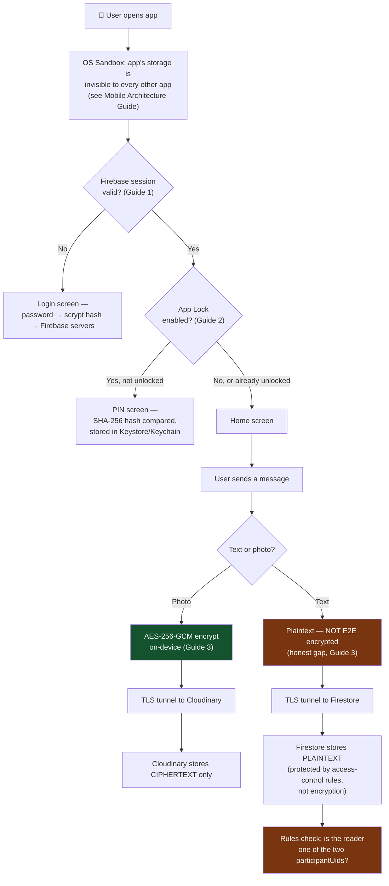
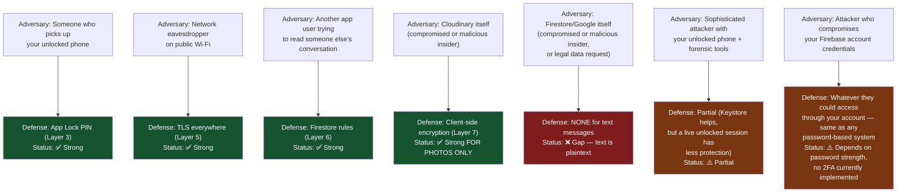
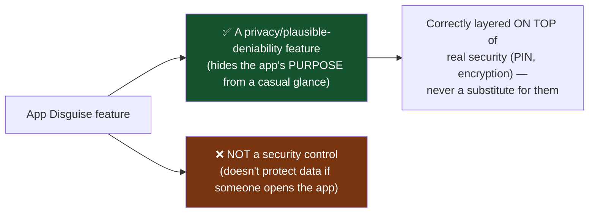
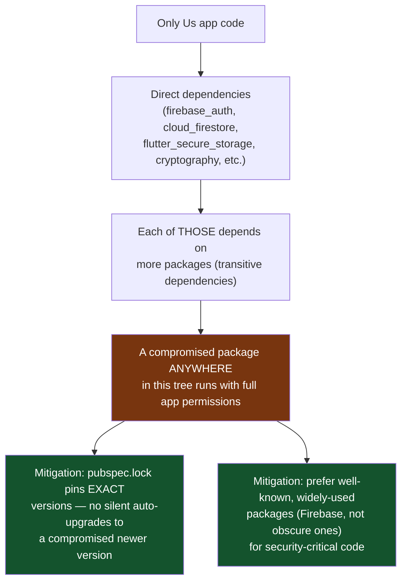
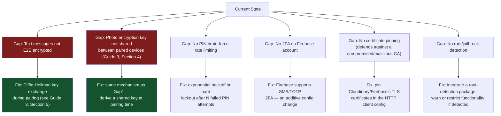

# Full App Security Architecture — Defense in Depth

How all the individual pieces (auth, PIN lock, encryption, access control) combine into one coherent security posture — and, honestly, where the remaining gaps are. This ties together Guides 1-3 into the complete picture.

---

## 1. The Core Principle: Defense in Depth

No single security measure is ever perfect. The professional approach is **layering multiple, independent defenses** so that one failure doesn't mean total compromise.

```mermaid
flowchart TB
    subgraph Layers["Defense in Depth — Only Us"]
        L1["Layer 1: OS Sandboxing<br/>(Android/iOS isolate this app's data from other apps)"]
        L2["Layer 2: Firebase Authentication<br/>(proves who you are)"]
        L3["Layer 3: App Lock PIN + Biometric<br/>(proves you're physically present)"]
        L4["Layer 4: Secure local storage<br/>(Keystore/Keychain-backed, not plaintext files)"]
        L5["Layer 5: TLS in transit<br/>(defeats network eavesdroppers)"]
        L6["Layer 6: Firestore access-control rules<br/>(stops other users reading your data)"]
        L7["Layer 7: Client-side encryption for photos<br/>(defeats the cloud provider itself, for media)"]
    end

    L1 --> L2 --> L3 --> L4 --> L5 --> L6 --> L7

    style L1 fill:#1e3a5f,color:#fff
    style L2 fill:#3730a3,color:#fff
    style L3 fill:#6d28d9,color:#fff
    style L4 fill:#be185d,color:#fff
    style L5 fill:#14532d,color:#fff
    style L6 fill:#78350f,color:#fff
    style L7 fill:#0e7490,color:#fff
```

**Why layering matters concretely for this app**: if Layer 3 (PIN) were somehow bypassed, Layer 6 (Firestore rules) still stops that person from reading someone else's conversations remotely. If Layer 5 (TLS) somehow failed on a compromised network, Layer 7 (photo encryption) still keeps photos unreadable. No single layer is asked to be perfect — each one covers for the others' realistic failure modes.

---

## 2. The Full Data Journey — Every Layer, One Diagram

---

## 3. Threat Modeling — Who Are We Actually Defending Against?

A mature security design explicitly lists **who the adversaries are**, not just "hackers" vaguely. Here's an honest threat model for this app:

**This table is the single most valuable artifact in security engineering** — not because it's exhaustive, but because it forces explicit, falsifiable claims ("Status: ✅/⚠️/❌") instead of a vague "it's secure" statement that can't be checked or improved.

---

## 4. Why "Security Through Obscurity" Is Not on This List (And Why That's Correct)

A common beginner instinct: "if I hide how it works, isn't that a defense too?" This app has a genuinely interesting example to examine — the **App Disguise / Home Screen Disguise feature** (renaming the app to "Calculator" on the home screen).

This is exactly the right way to use an obscurity-style feature: as an *additional, complementary* layer that reduces the *chance someone tries to open the app at all*, stacked on top of real cryptographic and access-control defenses — never as a replacement for them. If someone does open the disguised app, the PIN gate (real security) still has to hold.

---

## 5. The App's Dependency Supply Chain — An Often-Overlooked Attack Surface

Every third-party package this app depends on is code you didn't write, running with the same permissions as your own code.

This project's `pubspec.lock` being committed (per this project's own `CLAUDE.md` standards) is a genuine security-relevant decision, not just a "reproducible builds" nicety — it means a `flutter pub get` on a fresh checkout can't silently pull in a different (potentially compromised) version of any dependency than what was tested.

---

## 6. What a More Complete Security Posture Would Add (Honest Roadmap)

**None of these gaps are unusual for an app at this stage of development** — even production apps ship with a security roadmap, not a "finished" state. What matters is that the gaps are **known, documented, and prioritized** rather than silently assumed away. That's the actual discipline of security engineering: not claiming perfection, but knowing precisely where your current defenses end.

---

## 7. Putting It All Together — The One-Sentence Summary Per Layer

| Layer | What it actually guarantees | What it does NOT guarantee |
|---|---|---|
| OS Sandboxing | Other apps can't read this app's files | Doesn't stop this app's own code from being buggy |
| Firebase Auth | You are who your password proves you are | Doesn't stop someone who already has your unlocked session |
| App Lock PIN | Casual/opportunistic access is stopped | Doesn't stop a sophisticated attacker with your unlocked, live device |
| Secure storage (Keystore/Keychain) | PIN hash/tokens survive extraction attempts | Doesn't help if the device itself is unlocked and the app is running |
| TLS in transit | Network eavesdroppers see nothing useful | Doesn't stop the server at the other end from reading plaintext |
| Firestore rules | Other app users can't read your conversations | Doesn't stop Firestore/Google itself, or a rules misconfiguration |
| Photo encryption | Cloudinary can't view uploaded photos | Doesn't yet let the OTHER paired device decrypt them (known gap) |

---

## Glossary

- **Defense in depth** — layering multiple independent security controls so no single failure causes total compromise
- **Threat model** — an explicit list of adversaries and what each defense does/doesn't stop them from doing
- **Security through obscurity** — hiding *how something works* as a defense; weak alone, acceptable as a supplementary layer only
- **Supply chain (software)** — the full tree of third-party code (direct + transitive dependencies) your app relies on
- **Certificate pinning** — hardcoding expected server certificates so even a compromised Certificate Authority can't intercept your traffic
- **Root/jailbreak detection** — checking if the OS's security model has been bypassed on the device, since it weakens Keystore/Keychain guarantees
