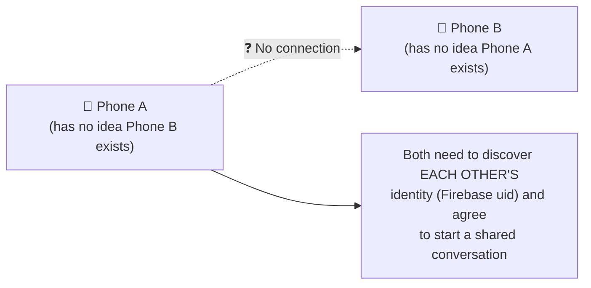
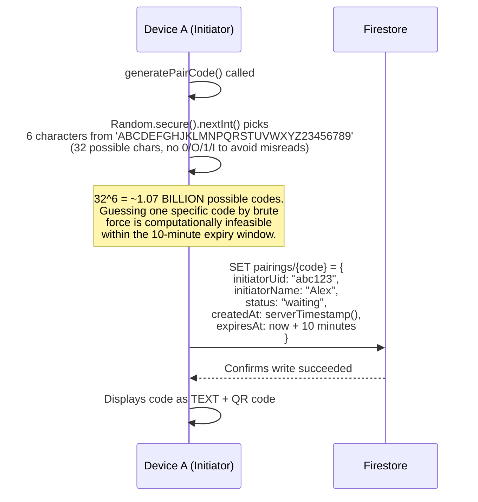
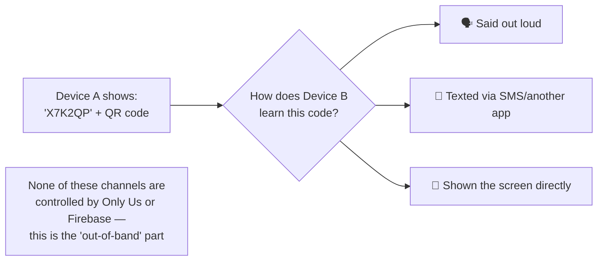
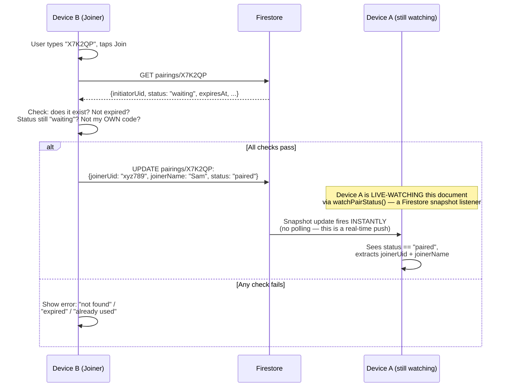
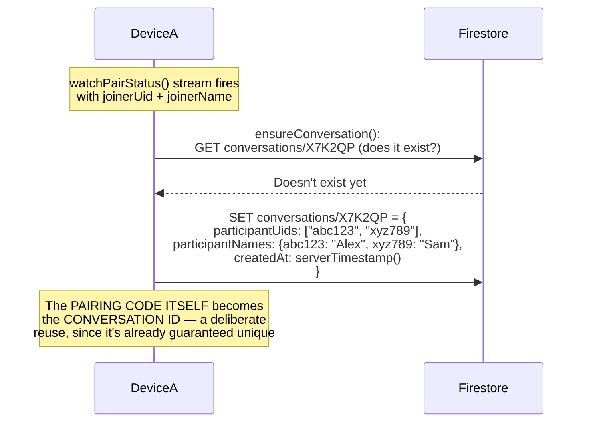
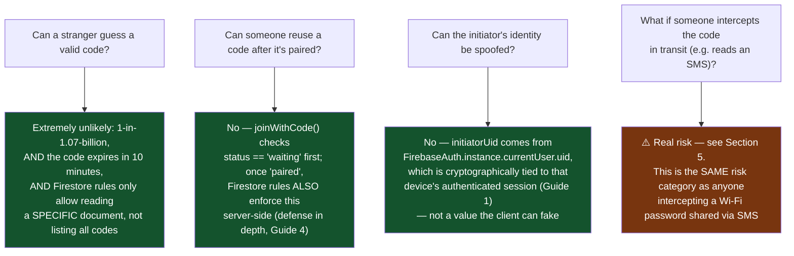
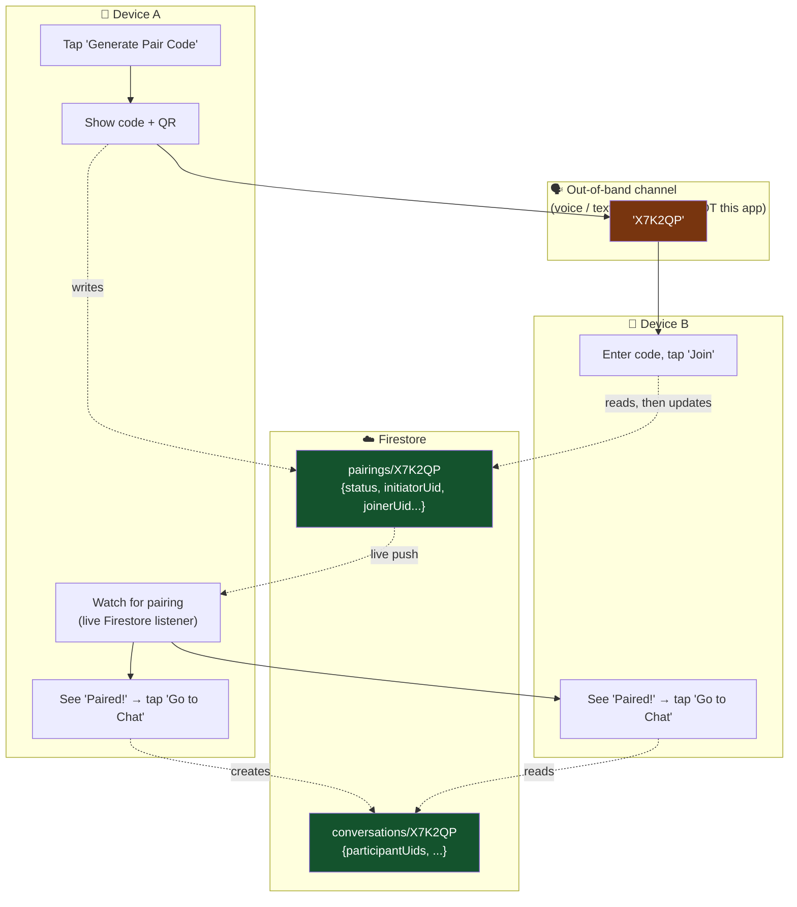
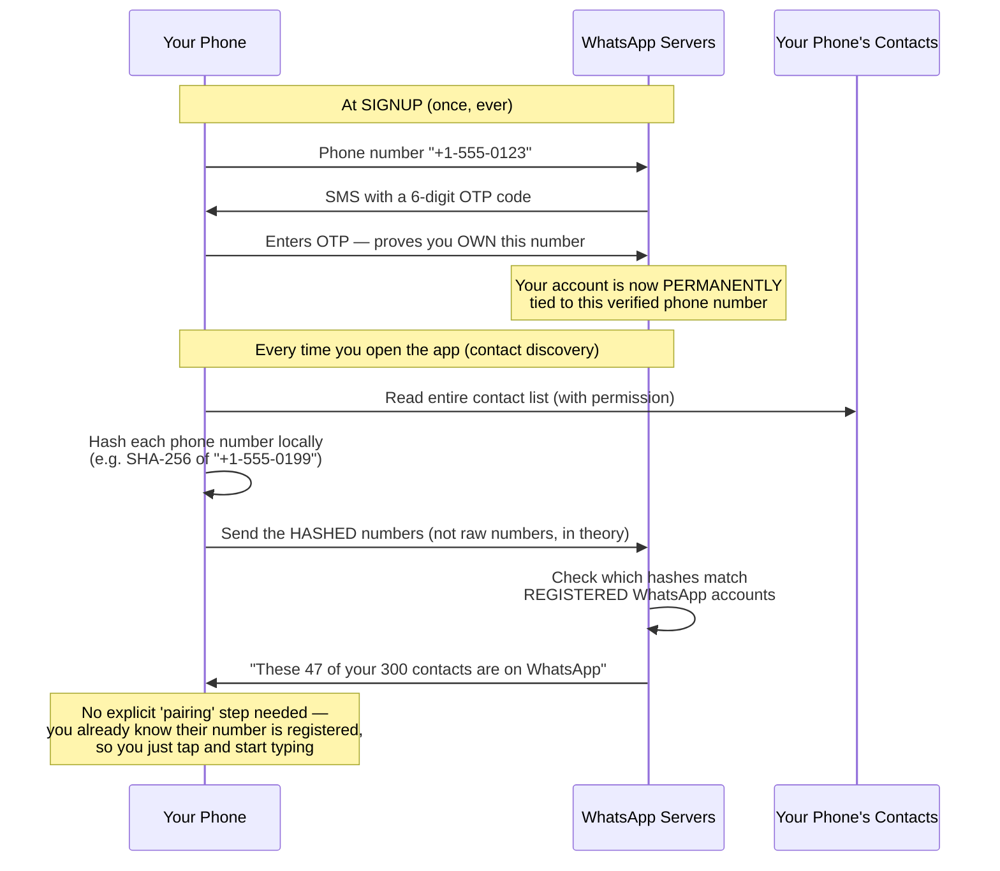
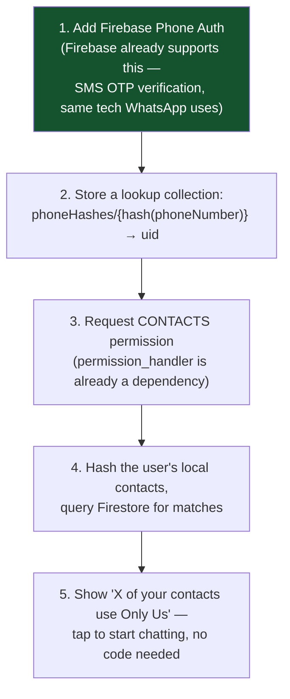
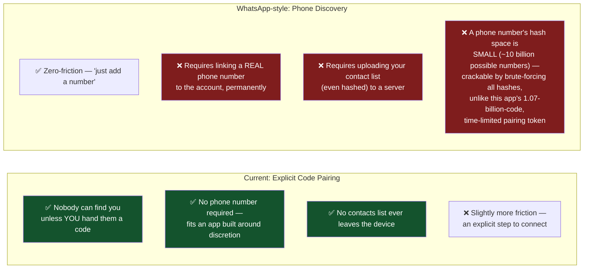

# Device Pairing — Deep Dive (and: Could We Do It Like WhatsApp?)

How two phones actually find and connect to each other in this app, why it's designed the way it is, and an honest comparison against WhatsApp's "just add a number" model — including whether that model would even make sense for an app like this one.

---

## 1. The Fundamental Problem Pairing Solves

Two phones, on two different networks, with no prior connection to each other, need to agree: **"You and I are now going to talk, and we both know who the other one is."**



There are exactly two ways any app solves this:
1. **Out-of-band code exchange** — the two people exchange a secret (a code, a QR, a link) through some channel *outside* the app (voice, text, in person) — **this is what Only Us does**.
2. **Directory lookup** — the app already has a way to look you up by something you already know about the other person (their phone number) — **this is what WhatsApp does**.

These are genuinely different trust models, not just different UI. Let's go deep on both.

---

## 2. How Pairing Actually Works in This App — Full Low-Level Walkthrough

### Step 1: Generating a Code



**Why `Random.secure()` and not a plain `Random()`?** Dart's default `Random()` is a pseudo-random number generator seedable and predictable in some contexts — fine for game logic, **not fine for anything security-adjacent**. `Random.secure()` pulls from the OS's cryptographically-secure random number source (which itself draws from hardware entropy — things like timing jitter, sensor noise). This matters because a *predictable* pairing code would let an attacker who somehow learned the generation pattern guess valid codes instead of needing all 1.07 billion attempts.

### Step 2: The Code Leaves the App (Out-of-Band)



This is the crucial design choice: **the code transmission itself never touches this app's servers.** Only Us has zero visibility into *how* the code got from Device A to Device B — it could be whispered, texted, or shown on-screen. This is deliberately similar to how Signal's "safety number" verification works, or how a Wi-Fi password gets shared — the secret handshake token moves through a channel the app itself doesn't control or log.

### Step 3: Joining



**The "watching" mechanism is the same real-time technology used throughout this app's chat** — `watchPairStatus()` opens a Firestore **snapshot listener**, which is a persistent connection where Firestore proactively pushes updates the instant a matching document changes, rather than Device A repeatedly asking "has anything changed yet?" (which would be inefficient polling — see the Mobile Expert Guide's section on push vs. polling for why this matters for battery).

### Step 4: The Conversation Gets Created



**Why reuse the pairing code as the conversation id?** It's already guaranteed unique (Firestore would have rejected a duplicate write if two people ever generated the identical random code, astronomically unlikely at 1-in-1.07-billion odds anyway), so generating a *second* unique id for the conversation would be redundant work solving an already-solved problem.

---

## 3. Security Analysis — Why This Design Is Actually Sound



**The Firestore rules doing real enforcement work here** (from `firestore.rules`):
```
allow update: if request.auth != null
  && resource.data.status == 'waiting'
  && request.resource.data.joinerUid == request.auth.uid;
```
This isn't just app-code politeness — it's a **server-side guarantee**. Even if someone reverse-engineered the app and tried to call Firestore directly (bypassing the Flutter UI entirely), this rule still blocks joining an already-paired code, and still requires `joinerUid` to match whoever is actually authenticated in that request. The client-side checks in `PairingService.joinWithCode()` are a nice UX (fast local validation, friendly error messages) — the *real* security boundary is the server-enforced rule, which cannot be bypassed by a modified or malicious client.

---

## 4. High-Level Overview — The Whole Flow in One Diagram



---

## 5. Now — Could We Do It Like WhatsApp Instead? ("Just Add a Number")

This is a genuinely different architecture, not a small tweak. Let's break down what WhatsApp *actually* does under the hood.

### How WhatsApp's Model Really Works



**The critical enabling fact**: WhatsApp's *identity system itself* is the phone number, verified once via SMS OTP. Because identity = a real-world, already-known piece of information (a phone number you already have in your contacts), there's no need for an explicit "handshake" step — discovery *is* the pairing. Only Us's identity system is email + password (Firebase Auth, Guide 1), which is **not** something you'd already have about the other person the way you have their phone number.

### Could This App Add Phone-Number Discovery? Yes, Technically.



Every piece of this is technically buildable with packages already available in the Flutter ecosystem (`firebase_auth`'s phone provider, a `contacts_service`-style package, the existing `permission_handler`). This is **not** a hypothetical — it's a well-understood, common pattern.

### But Here's the Actual Tradeoff — and Why It May Not Fit *This* App



**The phone-hash cracking point (P4) deserves real explanation** — this is a genuine, widely-known criticism of contact-discovery systems generally (not specific to WhatsApp, but well-documented in security research about this pattern): there are only about 10 billion possible phone numbers globally (much fewer in any single country code), so an attacker can simply **precompute the hash of every possible phone number once** and permanently reverse any hash they later see — unlike this app's pairing code, hashing a phone number doesn't actually protect it, because the *input space* is small enough to exhaustively hash in advance. This is exactly the "rainbow table" problem from Guide 2, applied to phone numbers instead of PINs. Real-world systems that need contact discovery mitigate this with more advanced cryptographic techniques (Private Set Intersection protocols, or hardware-backed secure enclaves that even the server operator can't inspect) — meaningfully more complex than "just hash and compare."

### My Honest Take, Given This App's Actual Design Goals

This app's entire design philosophy — App Disguise, Fake PIN, deliberately avoiding relationship-specific wording, no permanent visible "Pair" tab — is built around **discretion and minimizing footprint**. Adding phone-number verification and contact-list access would work *against* that goal in two concrete ways: (1) it permanently ties an account to a real phone number, and (2) it requires a Contacts permission grant that itself could raise questions if someone glances at the phone's app permissions list. The current explicit-code model, while requiring one extra step, has **zero such footprint** — no phone number, no contacts access, nothing to explain if someone reviews the app's permissions.

**If reducing friction is the actual goal** (not literally copying WhatsApp's exact mechanism), a smaller, better-fitting improvement would be: making the QR-scan path work (currently manual-entry only, per Guide 3's/README's earlier note) so pairing becomes "scan the other person's screen" instead of "read/type six characters" — same privacy properties, less friction, no new permission or identity model required.

---

## Glossary

- **Out-of-band channel** — a communication path outside the system being secured (e.g. saying a code out loud instead of sending it through the app itself)
- **Snapshot listener** — a persistent, real-time subscription to a Firestore document/query that pushes updates instantly instead of polling
- **Cryptographically secure random number generator (CSPRNG)** — a random source suitable for security purposes, seeded from real hardware entropy, unlike a plain pseudo-random generator
- **Contact discovery** — the technique of matching a user's phone contacts against a service's registered users, typically via hashing
- **Private Set Intersection (PSI)** — advanced cryptographic protocols letting two parties find common elements between their data sets without revealing the rest of either set — the "real" fix for contact-discovery privacy leakage
- **Rainbow table attack** — precomputing hashes of all likely inputs so any observed hash can be reversed instantly; effective when the input space (like phone numbers) is small enough to exhaust
