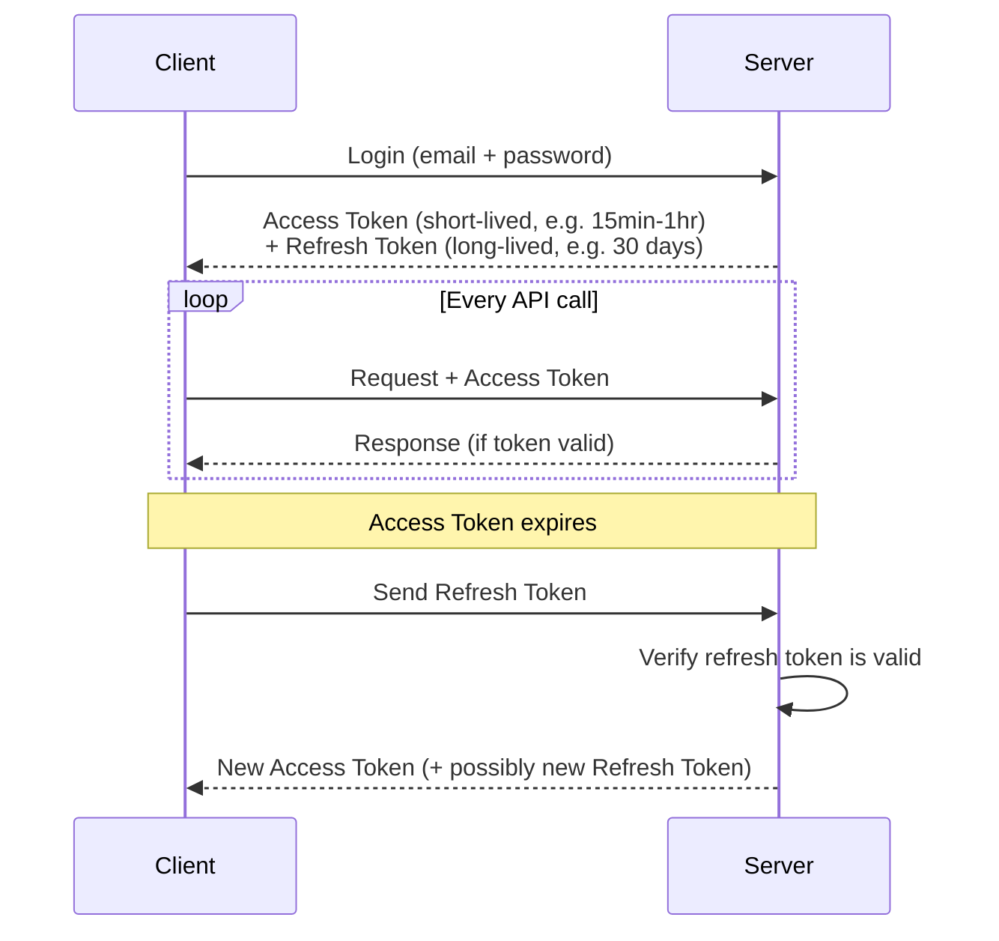
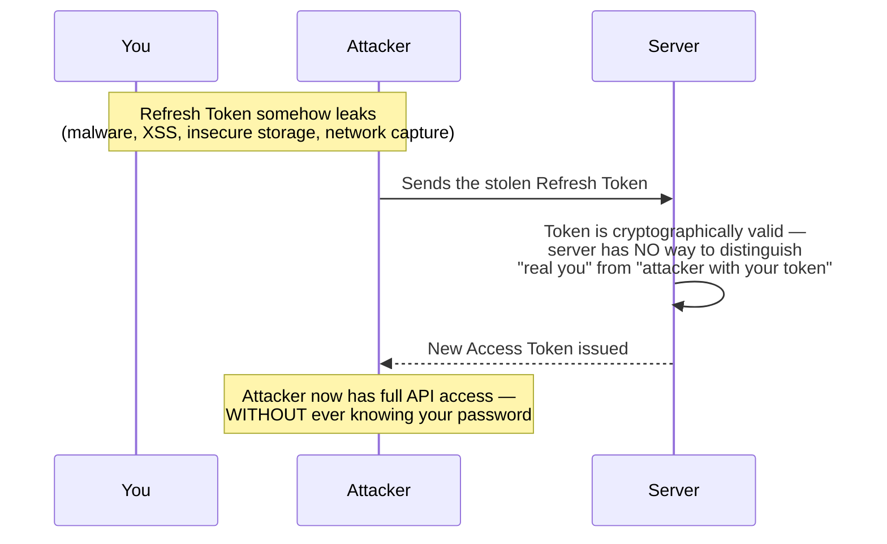
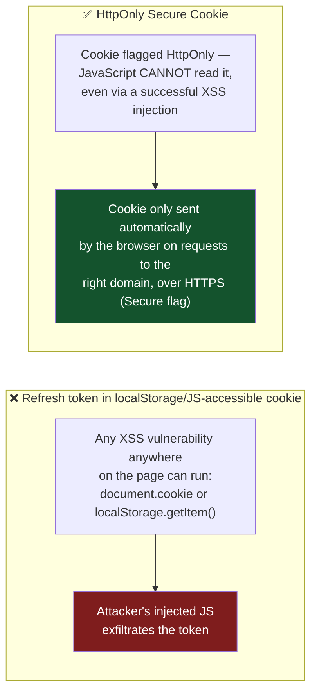
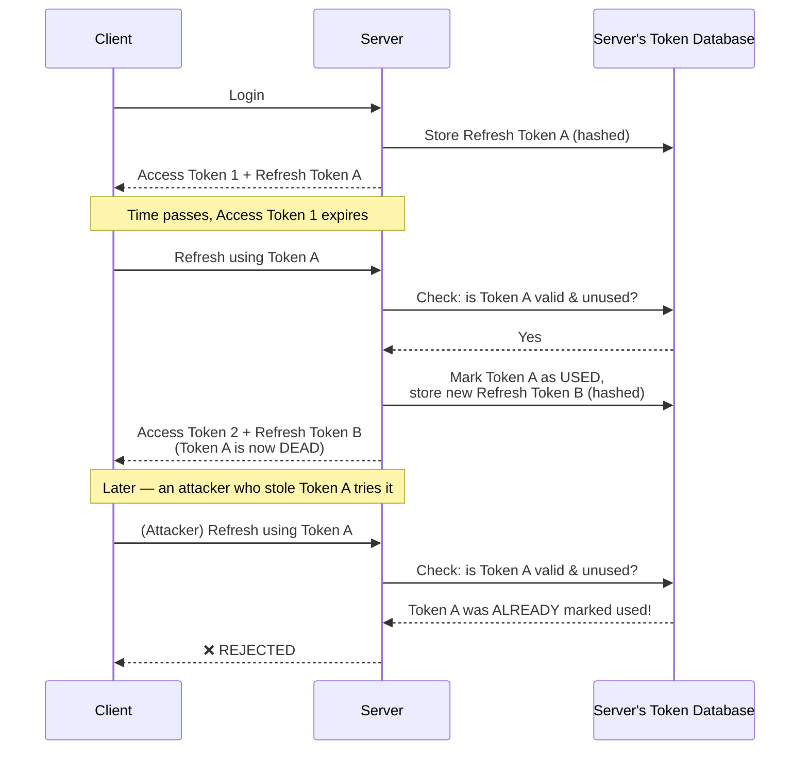
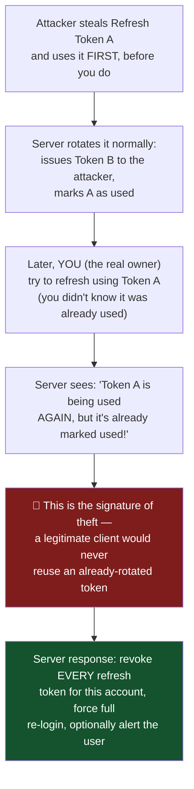
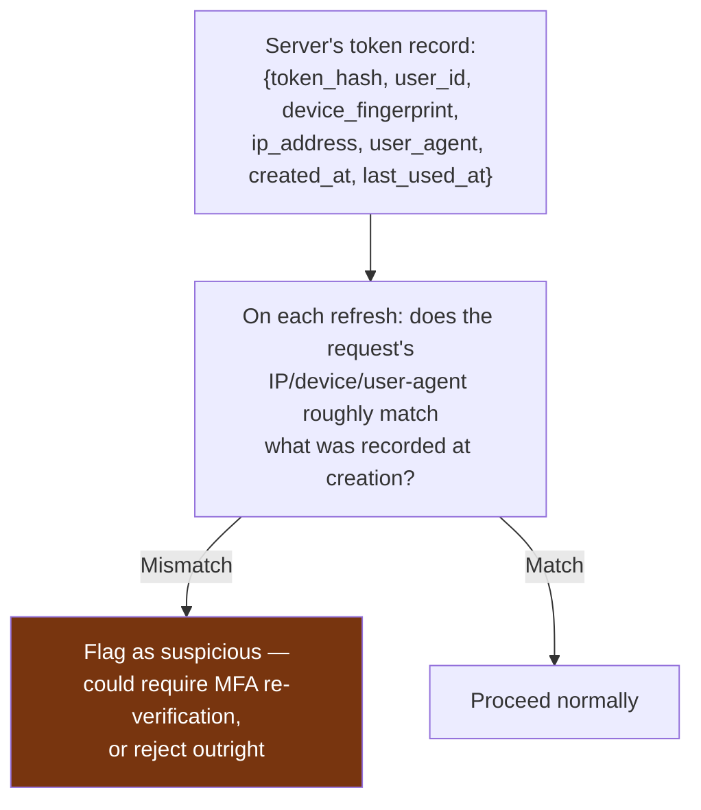
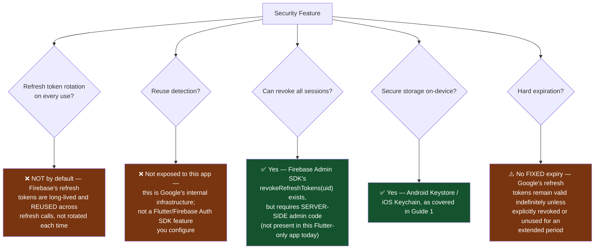
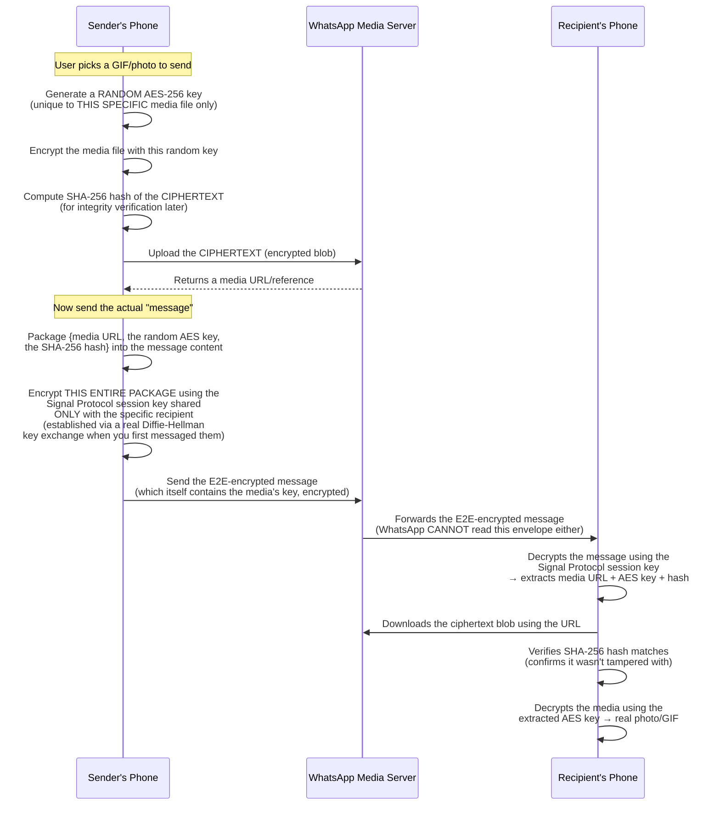
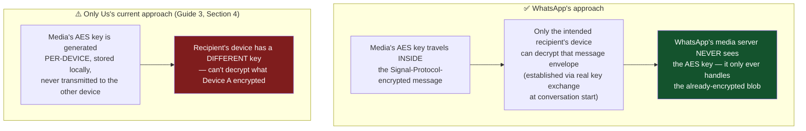
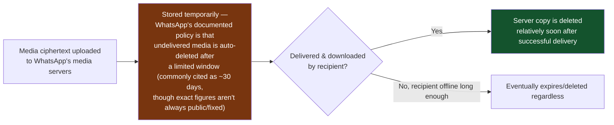

# Refresh Token Attacks & Defenses, and How WhatsApp Actually Encrypts Media

Two related deep-dives: (1) what happens if a refresh token is stolen, and the real production defenses against it — including an honest check of what *this app's* Firebase Auth actually does vs. the more advanced schemes companies like LinkedIn use — and (2) exactly how WhatsApp encrypts and stores images/GIFs, compared directly to how Only Us does it today.

---

# PART A — Refresh Token Theft: Attacks and Defenses

## A1. The Baseline Flow (Recap, Corrected Slightly)

This matches how this app's own auth works too (see Guide 1) — Firebase's SDK plays the role of "Client" here, doing this refresh dance automatically in the background, so `FirebaseAuth.instance.currentUser` never needs you to manually intervene.

## A2. The Theft Scenario — Why a Stolen Refresh Token Is So Dangerous

**The core danger**: a refresh token is a bearer credential — whoever *possesses* it is treated as authenticated, full stop. Unlike a password, there's no additional "prove you know this" step at refresh time. This is exactly why every defense below exists.

## A3. Defense 1 — Secure, HttpOnly Storage (Web Context)

**This specific defense is web-browser-specific** — mobile apps (like Only Us) don't have cookies or XSS in the browser sense. The mobile equivalent is **Android Keystore / iOS Keychain** storage (see Guide 1, Section 5) — hardware-backed, not readable by other apps, and not extractable even with root access on a patched device. Different mechanism, same underlying goal: make the token inaccessible to anything except the legitimate app/browser session.

## A4. Defense 2 — Refresh Token Rotation

This is the most important mechanism, and worth being precise about exactly how it works:

**The key insight**: each refresh token is single-use. The instant it's used once, it's invalidated and replaced. A stolen *old* token that the real user has already refreshed past is worthless — it's already dead in the server's records.

## A5. Defense 3 — Reuse Detection (The Clever Part)

This catches theft **even when the attacker uses the stolen token before the real user does**:

**Why this specific signal is so reliable**: in normal, honest operation, a refresh token is used exactly once and then discarded by its legitimate holder. The *only* way a used-and-rotated token gets presented again is if there are now **two parties holding a copy of what was supposed to be a single-use secret** — which can only happen if it was stolen at some point. The server doesn't need to know *how* it leaked; the reuse pattern itself is the alarm.

## A6. Defense 4 — Binding Tokens to Device/Session Metadata

This is a *heuristic*, not a hard guarantee (IP addresses change legitimately — mobile networks, VPNs, travel), so production systems usually treat a mismatch as "add friction / require re-verification" rather than an instant hard block, to avoid locking out legitimate users too aggressively.

## A7. Defense 5 — "Log Out Everywhere" and Defense 6 — Expiration

Both are simple but essential: a server-side revocation list (or database delete) that the "log out all devices" button triggers, and a hard ceiling (7/30/90 days) so even a token that somehow evades all other detection eventually stops working on its own.

## A8. So — What Does *This App* (Firebase Auth) Actually Do?

Time for an honest check against the real implementation, not just theory.

**Why the gap is acceptable here (but wouldn't be for a bank)**: Firebase deliberately optimizes its refresh token model for *convenience at consumer-app scale* rather than the more paranoid rotation/reuse-detection scheme LinkedIn-style enterprise systems build themselves on top of raw OAuth. Google's own infrastructure does have anomaly detection at a platform level (unusual sign-in location prompts, "new device" email alerts on some Google products), but that's Google's *account* security layer, separate from and mostly invisible to what a Firebase Auth *app developer* configures. If this app ever needed LinkedIn-grade protection, the correct move would be layering **Firebase Admin SDK server-side code** (a Cloud Function) that tracks device/session metadata *on top of* Firebase Auth — Firebase gives you the identity primitive, not the full enterprise session-security stack, by design.

---

# PART B — How WhatsApp Actually Encrypts and Stores Images/GIFs

## B1. The Short Answer

**WhatsApp media (photos, videos, GIFs, voice notes) is encrypted client-side before upload, and WhatsApp's servers store only ciphertext — genuinely unreadable to WhatsApp itself.** This is a real, verified end-to-end encryption implementation (published in WhatsApp's own security whitepaper, and independently audited), not marketing language.

## B2. The Full Flow — Step by Step

## B3. The Critical Design Detail — Where Does the Media Key Actually Travel?

This is the exact piece that makes it genuinely end-to-end, and it's the precise thing Guide 3 flagged as **missing** in Only Us's current implementation:

**This directly validates the fix already proposed in Guide 3**: the missing piece in Only Us is exactly the mechanism WhatsApp relies on — transmitting the *media's encryption key* through an already-established, genuinely end-to-end encrypted channel between the two specific paired devices (built via Diffie-Hellman key exchange at pairing time), rather than each device generating and keeping its own unrelated key.

## B4. Is the Media Stored on WhatsApp's Servers Forever?

No — and this matters for a full picture:

**Compare this directly to Only Us today**: this exact question (should we auto-delete media from Cloudinary once the recipient has downloaded it) is precisely what you asked in an earlier conversation this session — and the honest answer given then still holds: doing this safely requires a small server-side function (since deleting from Cloudinary needs the API secret, which can't live in the client app), which was deliberately deferred until real cross-device photo sharing existed. WhatsApp's server-side deletion is the same *category* of feature — a lifecycle policy layered on top of the encryption, not a replacement for it.

## B5. Side-by-Side Summary

| | WhatsApp | Only Us (current state) |
|---|---|---|
| Is media encrypted before upload? | ✅ Yes (per-file random AES key) | ✅ Yes (per-device AES key) |
| Can the server read the media? | ❌ No — stores ciphertext only | ❌ No — stores ciphertext only |
| Can the *specific recipient* decrypt it? | ✅ Yes — key travels via Signal Protocol's E2E channel | ❌ Not yet — key never leaves the sender's device (Guide 3 gap) |
| Is the server-stored copy deleted after delivery? | ✅ Yes, on a documented retention policy | ❌ Not yet — persists indefinitely in Cloudinary (deferred, needs a server function) |
| Is text also E2E encrypted the same way? | ✅ Yes — same Signal Protocol session | ❌ No — plaintext in Firestore (Guide 3, Section 3) |

---

## Glossary

- **Bearer token** — a credential where mere *possession* grants access, with no further proof required (both access and refresh tokens are bearer tokens by default)
- **Token rotation** — issuing a brand-new refresh token on every use and invalidating the previous one, limiting a stolen old token's usefulness to zero
- **Reuse detection** — recognizing that an already-rotated (dead) token being presented again is a reliable signal of theft
- **Signal Protocol** — the specific end-to-end encryption protocol (Double Ratchet + Diffie-Hellman) that WhatsApp, Signal, and several other messengers use for both text and media
- **Media key** — a random, per-file symmetric encryption key generated just for one piece of media, transmitted only through an already-secure channel to the intended recipient
- **Ciphertext blob** — encrypted binary data stored on a server, meaningless without the corresponding decryption key
