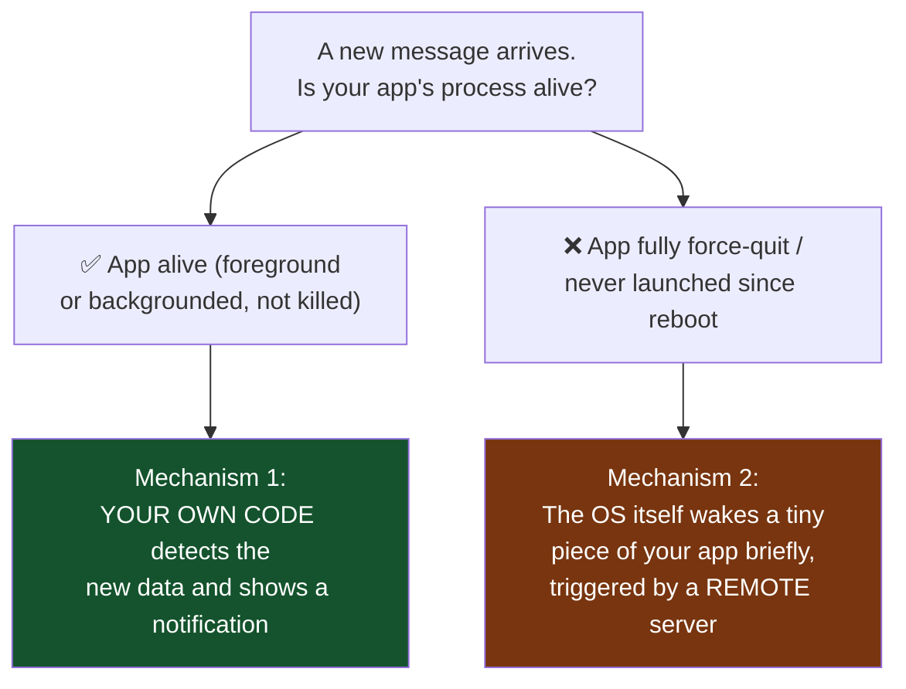
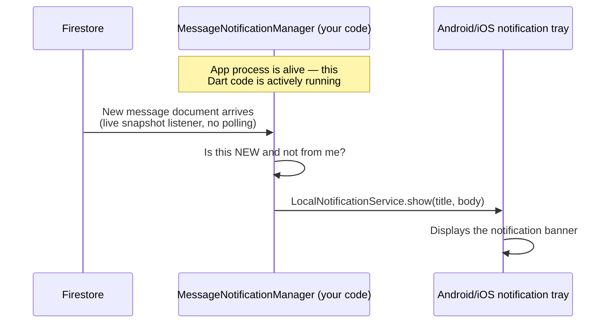
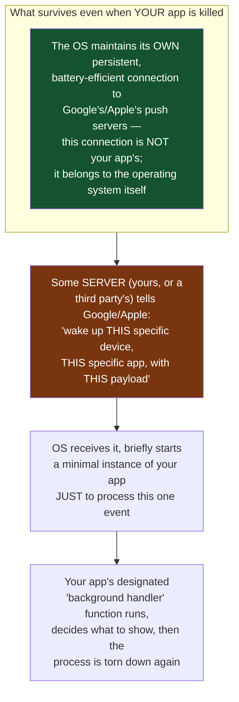
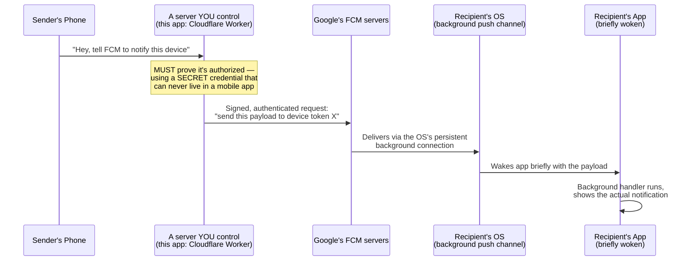
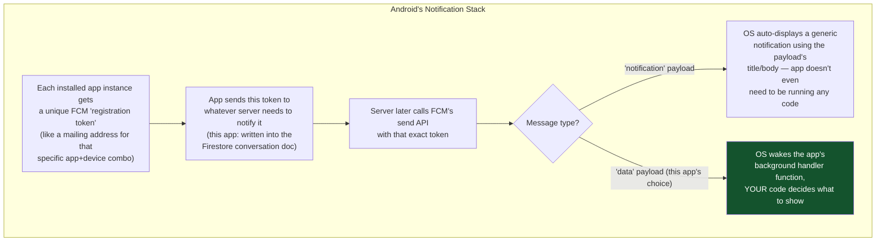
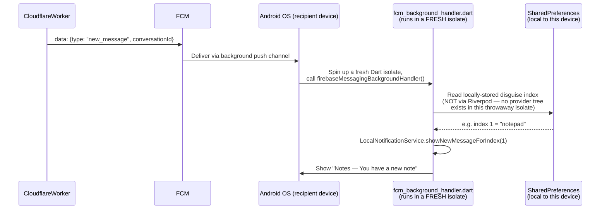
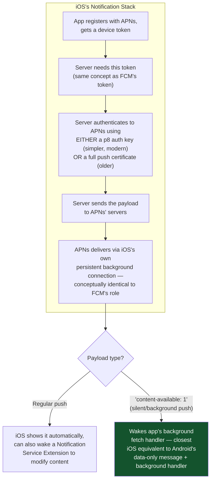
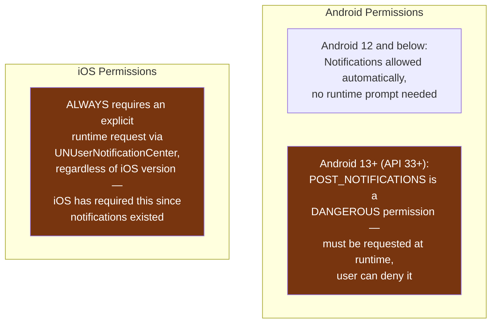
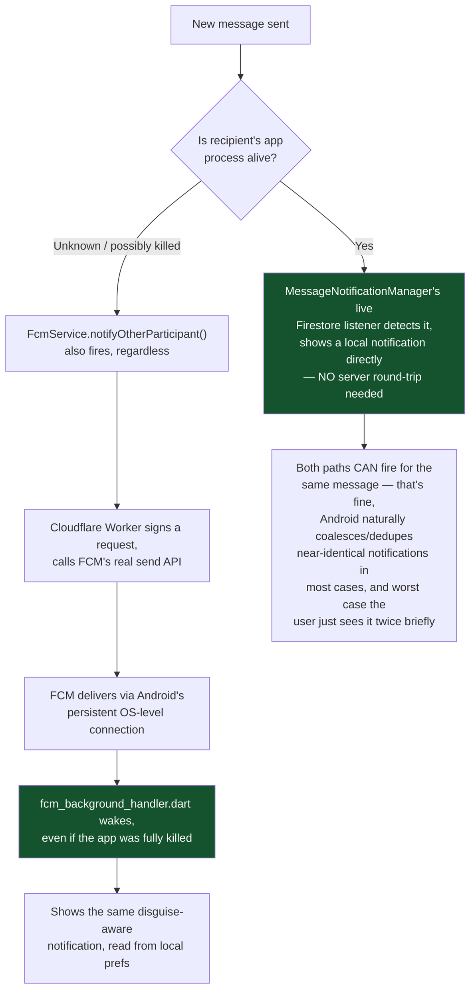

# Mobile Notifications — Deep Dive (Android & iOS)

How notifications actually reach your phone, why the answer is completely different depending on whether the app is alive or fully killed, and exactly what this app does at each layer. Grounded in the real implementation: `LocalNotificationService`, `MessageNotificationManager`, `FcmService`, and `fcm_background_handler.dart`.

---

## 1. The Core Confusion Beginners Have

"My app shows a notification" sounds like one feature. It is actually **two completely different mechanisms** depending on whether your app's process is running:

This single distinction explains almost every confusing thing about mobile notifications — including exactly why this app's notifications didn't work for a force-quit device until a server-side piece was added.

---

## 2. Mechanism 1 — App Alive: You're Just Watching Data Yourself

When your app process is running (foreground, or backgrounded but not killed), there's no magic here at all — it's just regular code, running continuously, that decides to show a notification.

**This is exactly what `message_notification_manager.dart` does** — it holds a live Firestore subscription (`watchMyConversations()` → `watchMessages()`) that's only running because your app's Dart isolate is alive. The moment you force-quit the app, this code stops executing entirely — there's no more "your code" for anything to run.

**Why this can't possibly work for a killed app**: there is no process, no listener, nothing. Code that isn't running can't detect anything or call anything. This isn't a bug to fix with better code — it's a structural fact about what "the app is killed" means.

---

## 3. Mechanism 2 — App Killed: The OS Itself Has to Wake You

This is the part that actually requires external infrastructure, and it's the same on both platforms conceptually (though the specific services differ).

**Critical insight**: this "wake the app briefly" capability is a privilege the OS grants specifically to its own push service (Firebase Cloud Messaging on Android, Apple Push Notification service/APNs on iOS) — not to random code. Your app cannot simply "listen in the background forever" on a killed process; that would let every app drain battery/RAM constantly, which both Android and iOS explicitly forbid. The OS-level push channel is the ONE narrow exception, and it only exists because Google/Apple built and maintain it as core OS infrastructure.

---

## 4. Why a Server Is Unavoidable for Mechanism 2 (This Is the Part That Confused Us Earlier)

**Why can't the sender's phone just call FCM directly, skipping a server?** Because authenticating to FCM's real send API (HTTP v1) requires a **Google service account private key** — a credential that, if embedded in a mobile app, could be extracted by anyone who decompiles the APK, and then used to send arbitrary push notifications to *every device* registered to your entire Firebase project. This is a categorically different risk than, say, an API key meant to be public — it's specifically designed to be a server-only secret. There is no way around needing *something* (a server, however small) to hold that secret safely. This is universally true — WhatsApp, Instagram, every app with real push notifications has a backend doing exactly this.

**This project's specific answer**: rather than Firebase Cloud Functions (which needs the paid Blaze plan), a free Cloudflare Worker plays the "something with the secret" role — same pattern already used for the Cloudinary media-deletion secret earlier in this project. The mechanism is generic; the specific free hosting choice is not.

---

## 5. Android Specifics — FCM

**Why this app deliberately uses a data-only payload, not the simpler auto-display option**: with an auto-display "notification" payload, the SENDER'S server would have to already know what text to put in the title/body — which would mean either revealing the recipient's chosen Home Screen Disguise to the sender (a privacy leak this app specifically avoids) or hardcoding something generic and never disguise-aware. Using a data-only payload instead means the OS just wakes the recipient's own code, which reads the recipient's OWN locally-stored disguise preference and decides the notification content itself — nobody else ever needs to know it.

**Why the background handler can't use Riverpod**: Android creates a brand-new, minimal Dart isolate just to run this one function, then destroys it — there's no `ProviderScope`, no widget tree, none of the app's normal state management running. This is why `fcm_background_handler.dart` reads `SharedPreferences` directly with the exact same storage key `HomeScreenDisguiseNotifier` uses, rather than trying to read the Riverpod provider (which doesn't exist in this isolate).

---

## 6. iOS Specifics — APNs (Apple Push Notification service)

iOS's equivalent is architecturally similar but has real differences worth knowing, even though this app is Android-only today:

**Key practical difference from Android**: iOS is significantly stricter about background execution time and frequency — a silent push doesn't guarantee your background code gets to run promptly or even at all if the OS decides the app has used its background budget too aggressively recently. Android's guarantee (via FCM's high-priority data messages) is generally more reliable for "wake me up right now" scenarios. This is a real, documented platform difference, not an implementation gap — Apple deliberately throttles background pushes harder to protect battery life fleet-wide.

---

## 7. Notification Permissions — What You Actually Have to Ask For

**In this app's code**: `LocalNotificationService.initialize()` calls `Permission.notification.request()` — this is specifically needed because of Android 13's stricter rule (declaring `POST_NOTIFICATIONS` in `AndroidManifest.xml` alone does nothing without also requesting it at runtime, which is why that permission was added there earlier in this project). If the user denies this permission, notifications will silently fail to display — there's no way to force them, by design, on both platforms.

---

## 8. Putting It All Together — This App's Full Notification Architecture

**Why both mechanisms run simultaneously rather than picking one**: they cover genuinely different situations. The live-listener path is instant and needs zero external infrastructure when it works, but only works while the process is alive. The FCM path is the only one that reaches a killed app, but depends on the Cloudflare Worker being deployed and network conditions cooperating. Running both means the app degrades gracefully — deploy the Worker and you get full coverage; skip it and you still get live-app notifications for free.

---

## Glossary

- **FCM (Firebase Cloud Messaging)** — Google's free, unlimited push notification service for Android (and cross-platform via Firebase)
- **APNs (Apple Push Notification service)** — Apple's equivalent for iOS
- **Registration/device token** — a unique identifier for one specific app installation on one specific device, used to address a push to it
- **Data-only vs notification payload** — a data payload wakes your own code to decide what to show; a notification payload lets the OS auto-display without your code running at all
- **Background handler** — a designated function the OS calls in a fresh, short-lived process/isolate when a push arrives and the app isn't otherwise running
- **Dangerous permission (Android)** — a permission category requiring an explicit runtime user grant, not just a manifest declaration
- **Service account** — a machine identity credential (not tied to a human user) used for server-to-server authentication, like a Cloudflare Worker calling FCM
