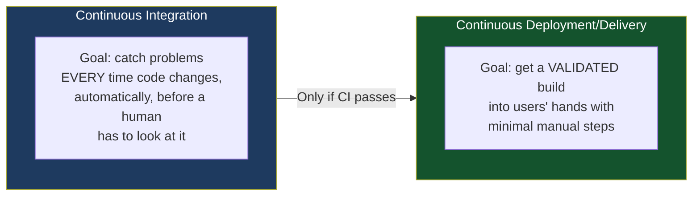
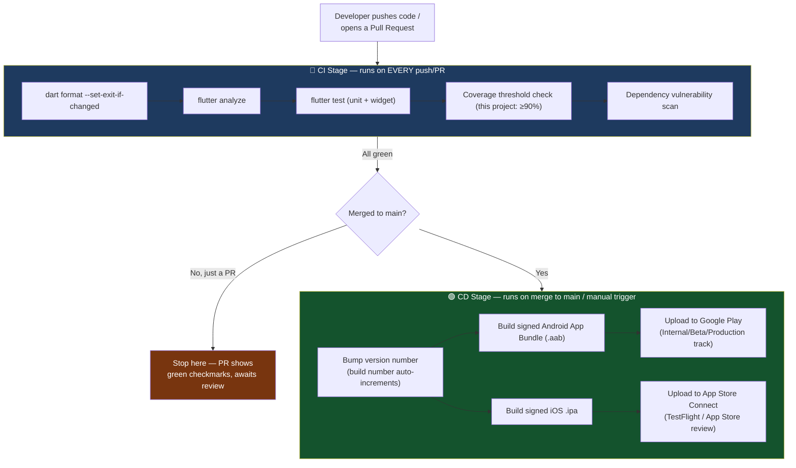
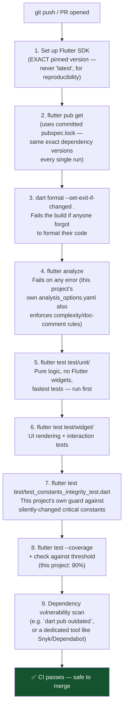
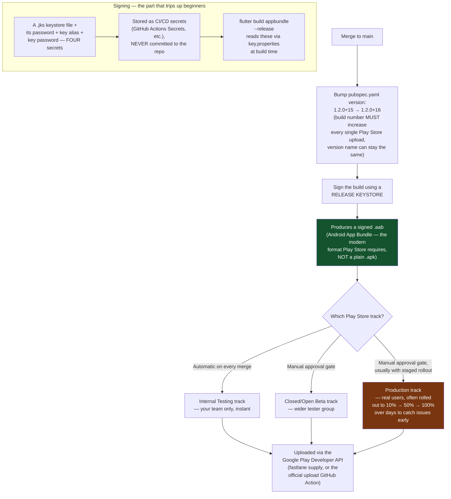
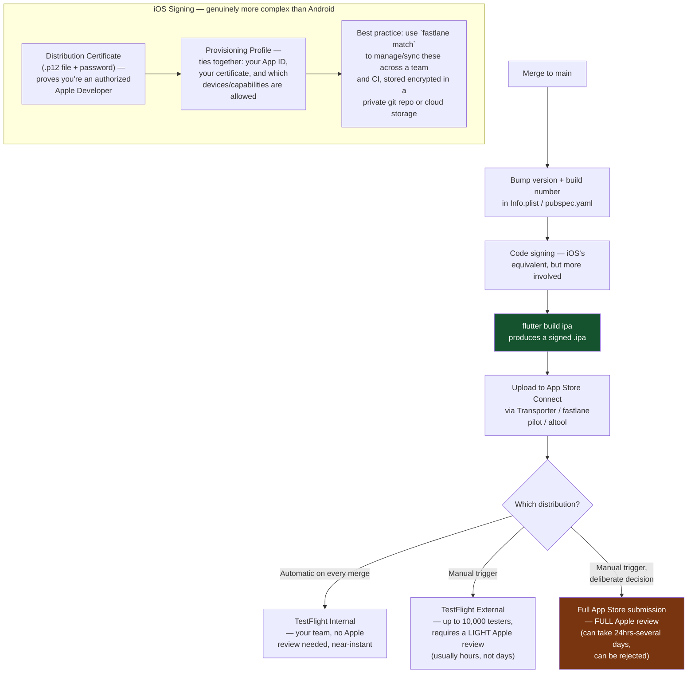
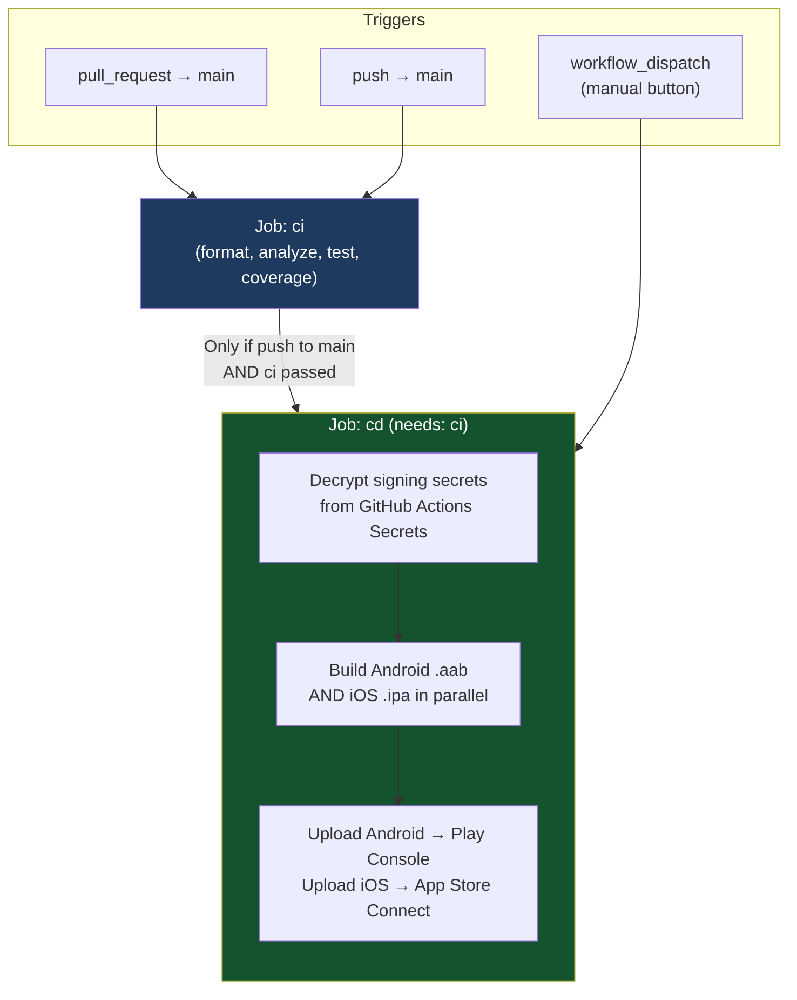
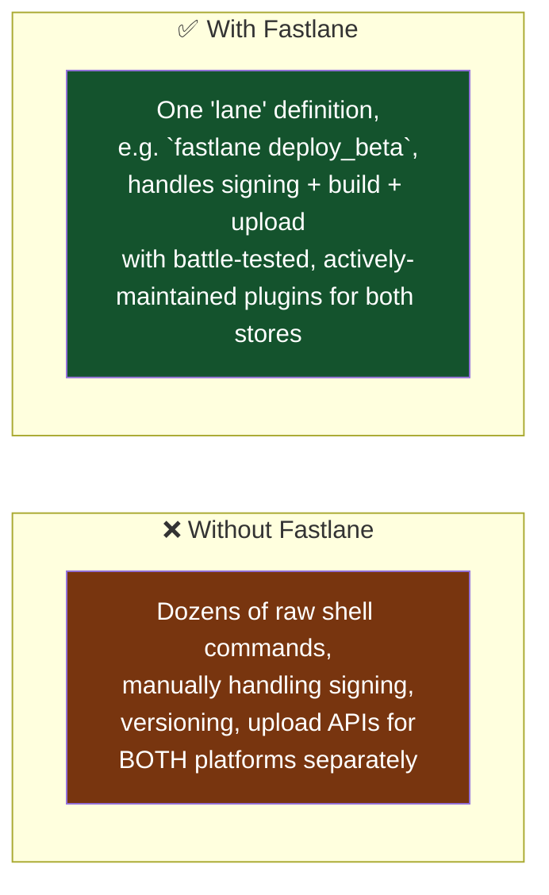
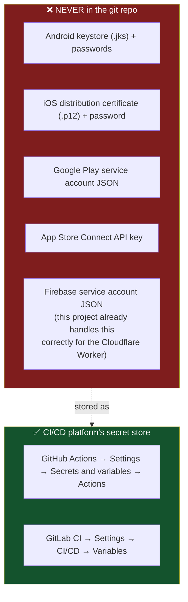
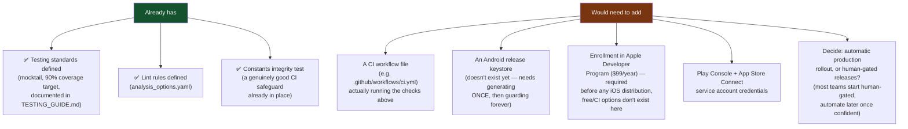

# Full CI/CD Guide for Mobile Apps (Android & iOS)

What Continuous Integration and Continuous Deployment actually mean for a Flutter app specifically, what belongs in each stage, and the complete automated path from a `git push` to your app appearing on the Play Store / App Store. Includes a full pipeline this project could adopt.

---

## 1. CI vs CD — The Distinction That Matters



**CI answers**: "Does this code still work?" — runs on every push/PR, fast, no app store involvement.
**CD answers**: "Is this specific validated version now available to real users?" — runs less often (e.g. on merging to `main`, or a manual trigger), involves signing, versioning, and store upload.

A team can have CI without CD (tests run automatically, but a human still manually builds and uploads to stores). Full CI/CD means both are automatic — merging to `main` can result in a new build reaching testers or even production with zero manual steps.

---

## 2. The Full Pipeline — High Level



---

## 3. CI Stage — Exactly What Should Run, and Why Each Piece



**Order matters for speed**: cheapest/fastest checks first (formatting, linting) so a trivial mistake fails in seconds, not after waiting for a 5-minute test suite to finish. This is why format/lint come before the test suite above.

**What should NOT run in CI**: anything that touches real external services (a real Firebase project, a real Cloudinary account, a real device) — CI must be fully deterministic and runnable with zero network dependencies, which is exactly why this project's own testing standard (`CLAUDE.md`) mandates mocked collaborators via `mocktail` for every test.

---

## 4. Android CD Pipeline — Full Detail



**The four Android signing secrets, explained simply**:
- **Keystore file** (`.jks`) — a file containing your app's private signing key. Google verifies every update to your app is signed with the SAME key, forever — lose this file and you can never update your app again under the same listing (this is a real, permanent-consequence risk, not hypothetical).
- **Keystore password** — unlocks the keystore file itself
- **Key alias** — a keystore file can technically hold multiple keys; this picks which one
- **Key password** — unlocks that specific key inside the keystore

**Staged rollout matters for real apps**: shipping straight to 100% of users means a bad build hits everyone before you can react. Rolling out 10% → 50% → 100% over a few days lets crash reports/reviews surface problems while limiting the blast radius — genuinely standard practice, not overcaution.

---

## 5. iOS CD Pipeline — Full Detail



**Why iOS signing is genuinely harder than Android's**: Android's signing is just "one file + a password, done by you alone." iOS's system involves Apple's own certificate authority, per-app provisioning profiles, and (for push notifications, specifically relevant to this app if it ever ships on iOS) separate APNs authentication keys — there are more moving pieces because Apple's model is built around centralized identity verification through their Developer Program, not just a self-signed key you generate once.

**Apple review is the one genuinely unpredictable step**: unlike Android's Play Store (largely automated policy checks), Apple's App Store review involves actual human reviewers who can reject an app for subjective reasons (UI quality, perceived policy violations, even something as specific as this app's core "hide messages/disguise the app" concept potentially drawing extra scrutiny around App Store review guidelines on deceptive functionality — worth researching Apple's specific guidelines before a real submission, not assuming Android's smoother path automatically transfers).

---

## 6. A Complete GitHub Actions Pipeline for This Project



**Example workflow structure** (conceptual — this project's own `TESTING_GUIDE.md` already has a simpler CI-only example to build from):

```yaml
name: CI/CD
on:
  pull_request:
    branches: [main]
  push:
    branches: [main]
  workflow_dispatch:

jobs:
  ci:
    runs-on: ubuntu-latest
    steps:
      - uses: actions/checkout@v4
      - uses: subosito/flutter-action@v2
        with:
          flutter-version: '3.27.0'  # pinned, never "latest"
      - run: flutter pub get
      - run: dart format --set-exit-if-changed .
      - run: flutter analyze
      - run: flutter test --coverage
      - run: |
          # Fail if coverage drops below 90%
          lcov --summary coverage/lcov.info

  cd:
    needs: ci
    if: github.ref == 'refs/heads/main'
    runs-on: macos-latest  # macOS needed for iOS builds
    steps:
      - uses: actions/checkout@v4
      - uses: subosito/flutter-action@v2
        with:
          flutter-version: '3.27.0'
      - run: flutter pub get

      # Android
      - name: Decode Android keystore
        run: echo "${{ secrets.ANDROID_KEYSTORE_BASE64 }}" | base64 -d > android/app/release.jks
      - run: flutter build appbundle --release
        env:
          KEYSTORE_PASSWORD: ${{ secrets.KEYSTORE_PASSWORD }}
          KEY_ALIAS: ${{ secrets.KEY_ALIAS }}
          KEY_PASSWORD: ${{ secrets.KEY_PASSWORD }}
      - uses: r0adkll/upload-google-play@v1
        with:
          serviceAccountJsonPlainText: ${{ secrets.PLAY_SERVICE_ACCOUNT_JSON }}
          packageName: com.example.only_us
          releaseFiles: build/app/outputs/bundle/release/app-release.aab
          track: internal

      # iOS
      - name: Install certificates & provisioning profile
        run: # (typically via fastlane match, or manual keychain import)
      - run: flutter build ipa --release
      - name: Upload to TestFlight
        run: xcrun altool --upload-app -f build/ios/ipa/*.ipa
          -u ${{ secrets.APPLE_ID }} -p ${{ secrets.APP_SPECIFIC_PASSWORD }}
```

---

## 7. Fastlane — The Tool Almost Every Real Mobile CI/CD Pipeline Uses



Fastlane is the de facto standard specifically because both Google Play's and Apple's upload APIs change occasionally, have quirks (like App Store Connect's API authentication being notoriously fiddly), and Fastlane's plugins absorb that complexity so your CI YAML stays simple (`fastlane android deploy` / `fastlane ios deploy` instead of hand-rolled API calls).

---

## 8. Secrets Management — What Goes Where



This is the exact same principle already applied in this project for Cloudinary's API secret and Firebase's service account key (both live in Cloudflare Worker secrets, never in the Flutter codebase) — CI/CD secrets management is the identical concept, just for a different set of credentials at a different stage of the pipeline.

---

## 9. What This Project Would Need to Add for Full CI/CD



**Honest note on cost**: unlike this project's careful avoidance of paid Firebase tiers, **the Apple Developer Program's $99/year fee is not optional** — there is no free tier for distributing an iOS app, even to a handful of testers via TestFlight. This is one wall that genuinely cannot be worked around with a clever free-tier substitute, unlike the Firebase Blaze-plan walls solved elsewhere in this project.

---

## Glossary

- **CI (Continuous Integration)** — automatically validating every code change (tests, linting) before it's trusted
- **CD (Continuous Deployment/Delivery)** — automatically getting a validated build to testers/users with minimal manual steps
- **AAB (Android App Bundle)** — the modern Play Store upload format (replaces plain `.apk` uploads), lets Google generate optimized APKs per device
- **Keystore** — a file holding your app's signing key(s); losing it can permanently break your ability to update an existing Play Store listing
- **Provisioning profile (iOS)** — ties together an App ID, a signing certificate, and allowed devices/capabilities
- **Fastlane** — the standard open-source tool automating mobile build/signing/upload for both platforms
- **Staged rollout** — releasing to a percentage of users first, increasing gradually, to limit damage from a bad release
- **TestFlight** — Apple's beta distribution platform, a prerequisite step before full App Store submission
