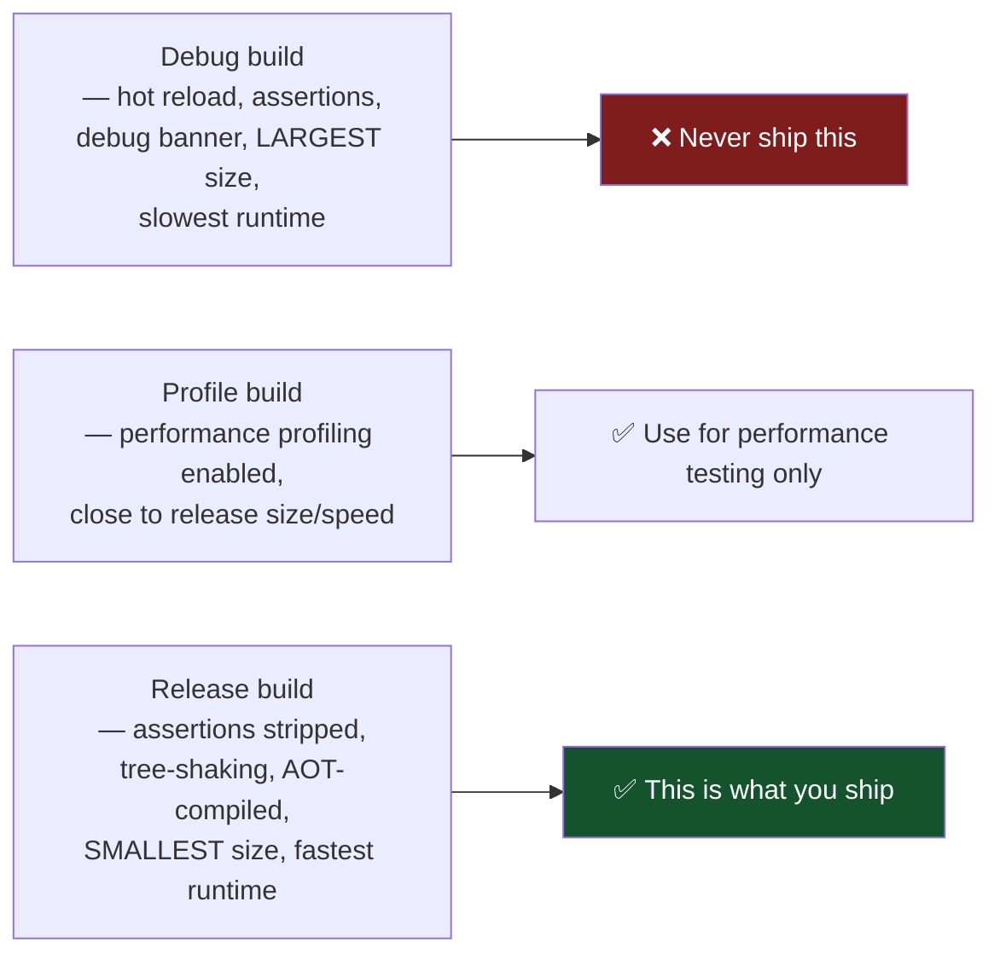
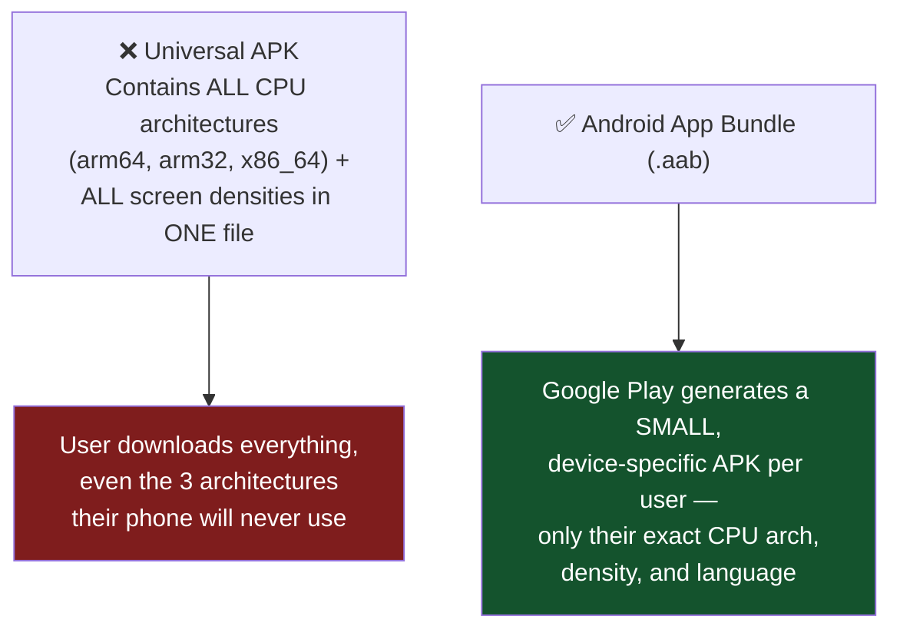
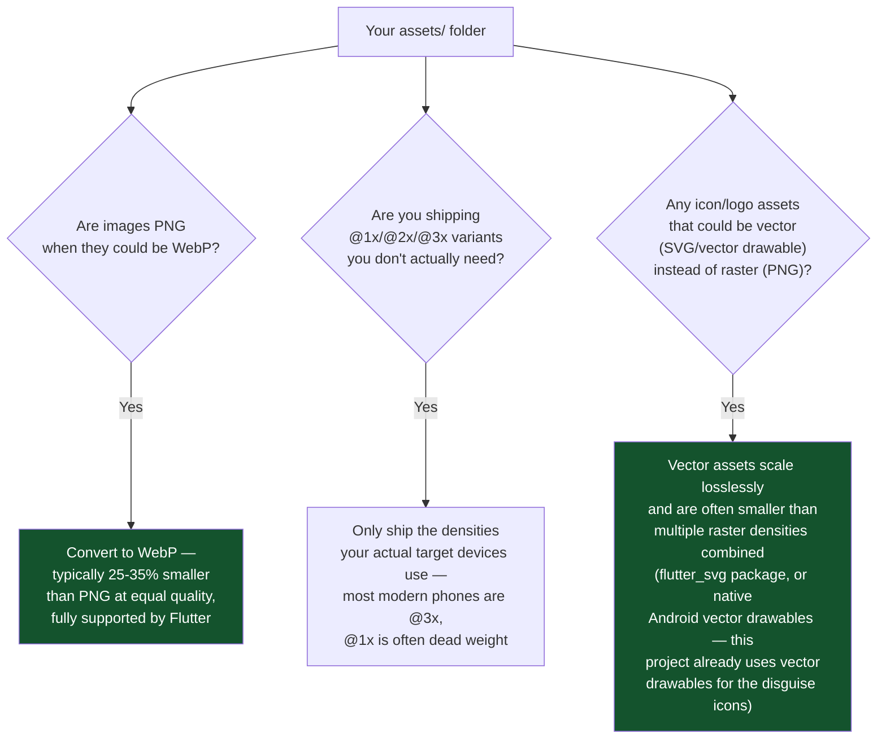
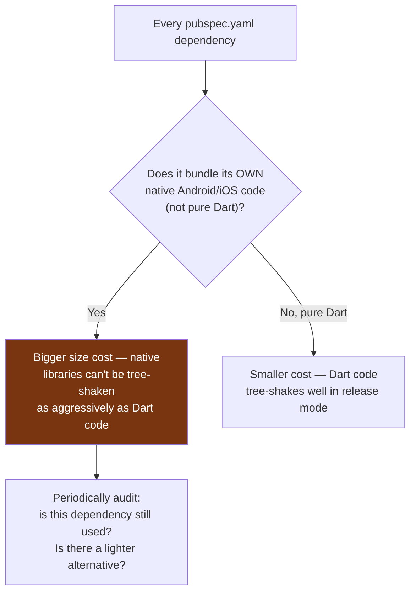
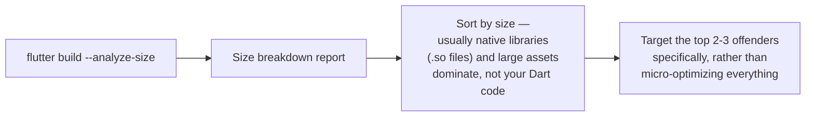
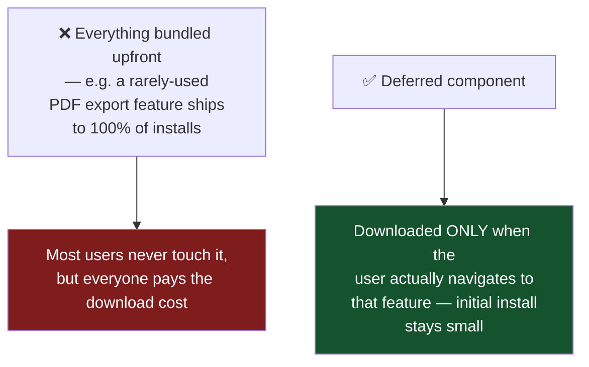

# Flutter Release Guide — Build & Minimize App Size (Android + iOS)

Every technique that actually reduces a Flutter release build's size, from the essential ones (do these, always) to advanced ones (only worth it for large apps). Ordered roughly by impact-to-effort ratio.

---

## 1. Build Modes — Know What You're Actually Shipping



**Always build with `--release` for anything you distribute.** A debug build can be 3-5x larger and noticeably slower — this alone is the single biggest "mistake" beginners make when they think their app "is just big."

```bash
flutter build appbundle --release   # Android, for Play Store
flutter build ipa --release         # iOS, for App Store
flutter build apk --release         # Android, for direct sideload testing only
```

---

## 2. The Essential Checklist (Do All of These — No Downside)

### 2.1 Use App Bundle (`.aab`), not a universal APK, for Play Store



```bash
flutter build appbundle --release
```
This alone is typically the single largest size reduction available, and it's just a build command choice — zero code changes needed. Never manually build/distribute a universal `.apk` for production; `.aab` is what Play Store expects.

### 2.2 Enable code shrinking (R8) and resource shrinking

In `android/app/build.gradle`:
```groovy
buildTypes {
    release {
        signingConfig signingConfigs.release
        minifyEnabled true
        shrinkResources true
        proguardFiles getDefaultProguardFile('proguard-android-optimize.txt'), 'proguard-rules.pro'
    }
}
```
- **`minifyEnabled true`** — R8 (Android's code shrinker) removes unused classes/methods and renames the rest to shorter names
- **`shrinkResources true`** — removes unused resources (layouts, drawables, strings) that minify alone can't detect, since it also requires minify to be on to know what's actually reachable

**Typical combined savings: 20-40% off the final size.**

### 2.3 Tree-shake icon fonts

```bash
flutter build appbundle --release --tree-shake-icons
```
If you use `Icons.xyz` from Material/Cupertino icon fonts, Flutter by default bundles the *entire* icon font (thousands of icons) even if your app uses 10 of them. This flag strips out every icon glyph you don't actually reference in code. Often saves 1-2MB by itself — worth doing on every build, no downside, works automatically as of recent Flutter versions but explicitly passing the flag guarantees it runs.

### 2.4 Split per ABI (for direct APK distribution/testing only — not needed for `.aab`)

```bash
flutter build apk --release --split-per-abi
```
Produces separate `app-armeabi-v7a-release.apk`, `app-arm64-v8a-release.apk`, `app-x86_64-release.apk` instead of one bloated universal file. **Only relevant if you're NOT using Play Store's `.aab` upload** (which already does this automatically) — e.g. for sideloading a test build directly to your own phone.

### 2.5 Check your `minSdkVersion` isn't unnecessarily low

Lower `minSdk` = broader device support, but sometimes forces including compatibility shims/desugared code for very old Android versions. Check `android/app/build.gradle`'s `minSdk = flutter.minSdkVersion` — if you don't actually need to support ancient Android versions, raising the floor (e.g. to API 23+) can shed some compatibility-library weight. Balance this against how many real users you'd exclude — don't raise it just for a marginal size win if it cuts off meaningful userbase.

---

## 3. Asset & Image Optimization



**Concrete numbers-driven approach**: run `flutter build appbundle --analyze-size` (see Section 5) and look at exactly which assets are largest — optimize the biggest offenders first rather than guessing. A single unoptimized 4000×3000 splash background PNG can single-handedly outweigh dozens of small UI icons combined.

### Font subsetting

If you bundle custom fonts (not just system fonts), only include the weights/styles you actually use (Regular + Bold, not all 9 weights if you only use 2). Each unused font weight file is pure dead weight, often 100-300KB each.

---

## 4. Dependency Hygiene — Every Package Is a Size Cost



**In this project specifically**: packages like `firebase_messaging`, `mobile_scanner`, `local_auth`, and `isar_flutter_libs` all bundle real native code (camera access, biometric APIs, a native database engine) — these are necessary costs for real functionality, not bloat to remove. The audit question is really "am I still using this package at all," not "should I avoid packages with native code" — a real feature that needs native capability is a legitimate size cost, not a mistake.

**Run this periodically:**
```bash
flutter pub deps
```
to see your full dependency tree, and manually check for anything pulled in that nothing actually calls anymore (a genuine, if occasional, source of silent bloat after refactors).

---

## 5. Actually Measuring Where Your Size Goes (Don't Guess)

```bash
flutter build appbundle --release --analyze-size
```

This generates a size breakdown you can open with Android Studio's **APK Analyzer**, or view the generated `.json` at `build/<platform>/...`. It shows exactly which DEX files, native libraries, assets, and resources are taking up space — the single most useful step before trying anything else, since it turns "size optimization" from guesswork into "fix the 3 things that are actually large."



---

## 6. Native Library / Debug Symbol Stripping

```bash
flutter build appbundle --release --split-debug-info=build/debug-info --obfuscate
```
- **`--split-debug-info`** — moves Dart debug symbols OUT of the shipped binary into a separate folder you keep privately (needed later to symbolicate crash reports, but shouldn't ship to users)
- **`--obfuscate`** — renames Dart symbols to short meaningless names, similar in spirit to what R8 already does for Java/Kotlin code, adding a further size reduction on the Dart side specifically

**Important**: back up the `build/debug-info` folder somewhere safe per release version — you need the matching debug-info to decode a real crash's stack trace later; losing it means future crash reports from that release become unreadable gibberish.

---

## 7. Advanced — Only Worth It for Large/Complex Apps

### 7.1 Deferred Components (Android Play Feature Delivery)


Flutter supports Android's Play Feature Delivery for genuinely optional, rarely-used, large features (e.g. an AR mode, a large offline dataset). **Not worth the complexity for a normal-sized app** — this is specifically for apps with large, clearly-separable optional modules. This project's feature set (chat, encryption, disguise, etc.) is all core/expected-to-be-used, so this technique doesn't apply here — mentioned for completeness at scale.

### 7.2 iOS App Thinning

iOS handles a good chunk of this automatically when you submit via App Store Connect — Apple's servers generate device-specific variants (similar in spirit to Android's `.aab` → per-device APK), stripping unused architecture slices and unused image resolutions from what a specific user's device actually downloads. **You mostly get this for free just by submitting through the normal App Store pipeline** — the main lever you control on the Flutter side is still Section 2-4's techniques (shrinking, asset optimization, dependency hygiene).

### 7.3 On-Demand Resources (iOS)

iOS's equivalent of deferred components — large, optional asset packs downloaded post-install rather than bundled in the initial download. Same "only for genuinely large optional content" caveat as 7.1.

---

## 8. Full Release Build Command (Everything Combined)

```bash
# Android — the complete, production-grade command
flutter build appbundle \
  --release \
  --tree-shake-icons \
  --obfuscate \
  --split-debug-info=build/debug-info/android

# iOS — the complete, production-grade command
flutter build ipa \
  --release \
  --tree-shake-icons \
  --obfuscate \
  --split-debug-info=build/debug-info/ios
```

Combined with `minifyEnabled`/`shrinkResources` already set in `android/app/build.gradle` (Section 2.2), this represents the full, realistic "minimum size" release pipeline for a Flutter app at this project's scale — the advanced techniques in Section 7 are genuinely not worth the added complexity unless the app grows substantially larger or gains large optional feature modules.

---

## 9. Quick Reference — Impact vs. Effort

| Technique | Size impact | Effort | Do it? |
|---|---|---|---|
| Build with `--release` (not debug) | 🔴 Huge | None | Always |
| Upload `.aab` not universal `.apk` | 🔴 Huge | None (just a flag) | Always |
| `minifyEnabled` + `shrinkResources` | 🟠 Large (20-40%) | ~5 min setup | Always |
| `--tree-shake-icons` | 🟡 Medium (1-2MB) | None (just a flag) | Always |
| WebP instead of PNG | 🟡 Medium | Low (convert assets) | Do for large images |
| Font subsetting | 🟢 Small-Medium | Low-Medium | Do if using custom fonts |
| `--obfuscate` + `--split-debug-info` | 🟢 Small | None (just flags) | Always (keep debug-info backed up) |
| Dependency audit | 🟢 Small-Medium, situational | Medium (periodic review) | Do periodically |
| Deferred components / On-demand resources | 🟢 Small for most apps | High | Only for large optional modules |

---

## Glossary

- **App Bundle (.aab)** — Google Play's upload format; Play generates small, device-specific APKs from it automatically
- **R8** — Android's code shrinker/obfuscator, successor to ProGuard, runs when `minifyEnabled true`
- **Tree-shaking** — removing code/assets that are provably never referenced/reachable
- **App thinning (iOS)** — Apple's automatic per-device optimization of what's actually downloaded from an App Store submission
- **Deferred components / On-demand resources** — optional app content downloaded only when actually needed, not bundled in the initial install
- **Debug symbols / debug info** — the mapping needed to turn an obfuscated crash stack trace back into readable function names; must be kept privately per release, never shipped to users
