# Mobile App Architecture — A Beginner's Guide (Android & iOS)

This guide explains how mobile apps actually work under the hood: processes, memory (RAM), storage, permissions, and sandboxing — using your **Only Us** Flutter app as the running example throughout.

---

## 1. The Big Picture — What Is "An App" to the OS?

On your laptop, "Only Us" is just a folder full of Dart files. Once installed on a phone, the OS treats it completely differently. Think of it like this:

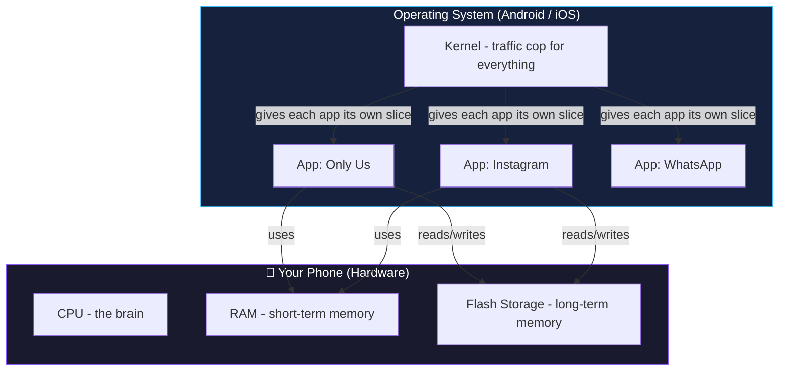

**Key idea:** Every app runs in its own isolated bubble. Only Us cannot see Instagram's files, cannot read Instagram's memory, and cannot use Instagram's camera permission. This isolation is called **sandboxing**, and it's the single most important security concept in mobile development.

---

## 2. RAM vs Storage — The #1 Confusion for Beginners

This trips up almost everyone starting out. Here's the plain-English version:

| | **RAM (Memory)** | **Storage (Disk)** |
|---|---|---|
| What it is | Short-term "scratchpad" | Long-term "filing cabinet" |
| Speed | Extremely fast | Much slower |
| Survives phone restart? | ❌ No — wiped clean | ✅ Yes — stays forever |
| Survives app force-close? | ❌ No | ✅ Yes |
| Analogy | Your desk while working | Your filing cabinet at home |
| In Only Us | The `_messages` list you see on screen right now | The `LocalMessage` rows saved in Isar |

### Real example from your app

Before you added Isar, your chat messages lived in a `List<Message>` in RAM only:

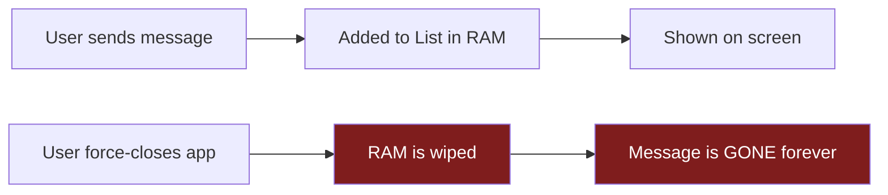

After adding Isar (a local database that writes to **storage**, not RAM):

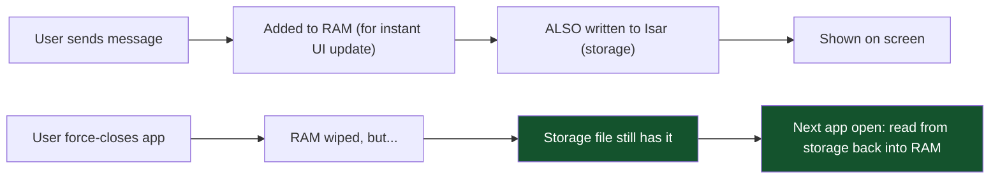

This is *exactly* why your `LocalMessageStore.put()` call happens on every send — it's writing to the filing cabinet (storage), not just the desk (RAM), so the message survives a restart.

---

## 3. What Happens When You Tap an App Icon? (The Process Lifecycle)

This is different enough between Android and iOS that it deserves its own section each.

### 3a. Android: Processes and the Activity Lifecycle

Android apps run as a **Linux process**. Each app = one process (mostly). Inside that process, your app has "Activities" (basically: screens) that go through a lifecycle.

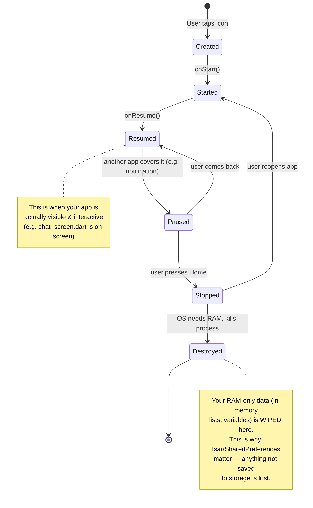

**Real-world trigger:** You open Only Us, then open 5 heavy games. Android's low-memory killer decides it needs RAM back, and **silently kills your Only Us process** in the background — even though you never explicitly closed it. When you tap back to Only Us, Android restarts the process from scratch (that's why apps sometimes "restart" instead of resuming exactly where you left off).

### 3b. iOS: Apps and the Suspended State

iOS is stricter about backgrounding. Instead of freely killing/restarting, iOS moves apps through defined states:

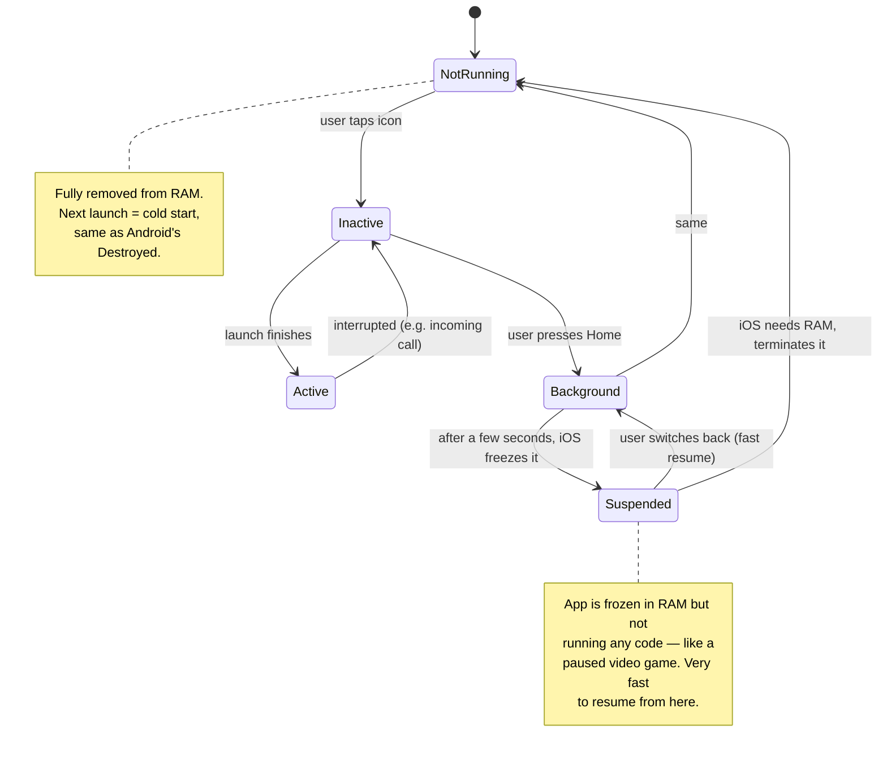

**Key difference from Android:** iOS tends to *suspend* (freeze) apps rather than kill them outright, so switching back to a backgrounded app on iPhone often feels instant — the app was never actually destroyed, just paused. Android is more aggressive about killing background processes to reclaim RAM, especially on budget phones (like the Moto G45 you're testing on) that have less RAM to begin with.

---

## 4. Where Does Your App's Data Actually Live? (Storage Deep Dive)

Both OSes give every app its own **private storage sandbox** — a folder on disk that only that app (normally) can read/write.

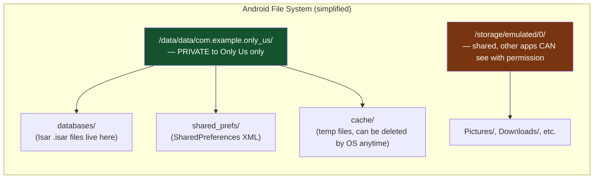

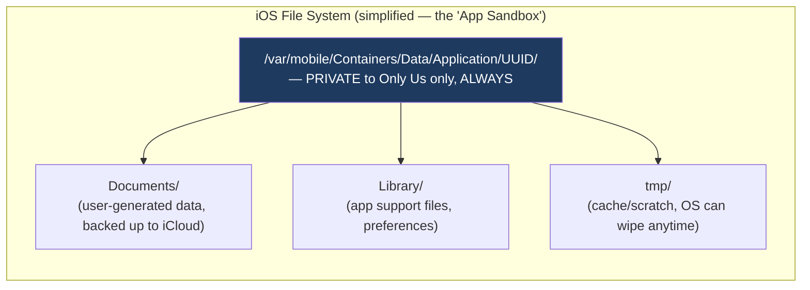

**The critical difference:** On Android, there's a concept of "external storage" that (with permission) other apps can browse — like a shared Downloads folder. **iOS has no equivalent** — every app's sandbox is 100% private, always. This is why file-sharing on iOS requires special APIs (like the Share Sheet or Files app integration) rather than just "give me the storage permission and I'll read anything."

### Where things live in YOUR app specifically

| What | Where it's stored | Type |
|---|---|---|
| Chat messages (`LocalMessage`) | `databases/` (via `IsarService`, using `path_provider`'s app documents dir) | Internal, private, persistent |
| App branding name/logo choice | `shared_prefs/` (via `shared_preferences` package) | Internal, private, persistent |
| PIN hash for App Lock | Encrypted keystore (via `flutter_secure_storage`) — **not** a plain file | Internal, private, encrypted |
| Custom logo image the user picks | Wherever `image_picker` returns a path from — usually a cache/temp copy | Internal, private, semi-temporary |
| Firebase auth session | Firebase SDK's own secure storage | Internal, private |

---

## 5. Cache vs Persistent Storage — Another Common Mix-up

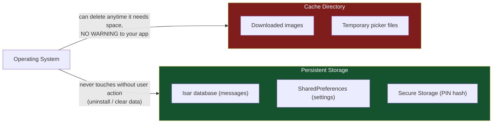

**Rule of thumb:** If losing the data would upset the user (their chat history, their PIN setup), it must go in **persistent** storage (Isar, SharedPreferences, Secure Storage). If it's disposable and re-creatable (a thumbnail you can re-download), cache is fine — and both OSes will delete cache contents automatically when the device is low on storage space, without asking you.

---

## 6. Permissions — Why Your App Has to "Ask"

Because of sandboxing (Section 1), your app *cannot* access sensitive hardware/data by default — camera, contacts, location, biometrics. It must explicitly request permission, and the **user** grants or denies it.

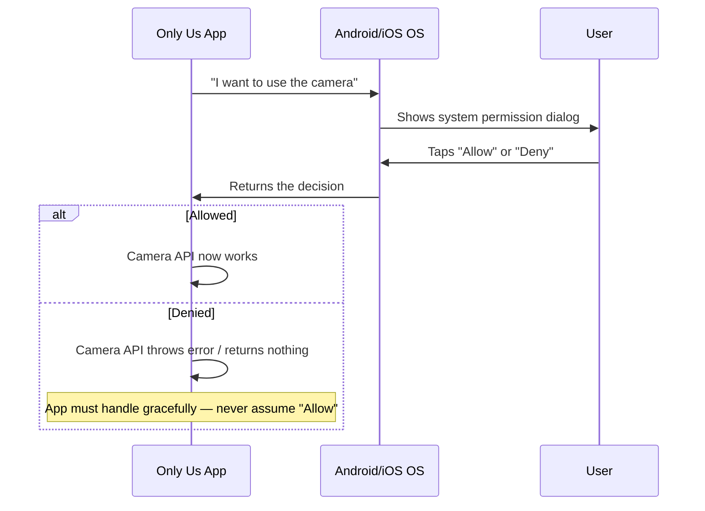

### Permissions your app actually declares

Looking at your `AndroidManifest.xml`, you already have:

```xml
<uses-permission android:name="android.permission.USE_BIOMETRIC" />
```

This is a **normal** permission — Android grants it automatically at install time because biometric usage isn't considered highly sensitive on its own (compare to camera/location, which are "dangerous" permissions requiring a runtime popup).

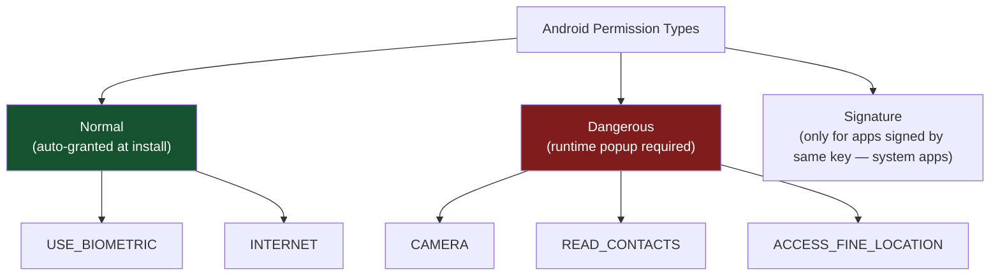

If you add photo/camera picking to Only Us later (mentioned in your roadmap), you'll need the `permission_handler` package (already in your `pubspec.yaml`!) to trigger the **dangerous** permission popup for gallery/camera access.

### iOS permissions work similarly, but declared differently

iOS doesn't use an XML manifest — it uses `Info.plist` with **usage description strings** that are *shown to the user* in the popup:

```xml
<key>NSCameraUsageDescription</key>
<string>Only Us needs camera access to let you send photos in chat.</string>
```

**Critical iOS rule:** If you don't include this description string and try to access the camera, iOS crashes your app outright — it doesn't just deny quietly. Android is more forgiving here.

---

## 7. Your App Disguise Feature — A Perfect Case Study

You just built a home-screen disguise feature. This is actually a great way to understand **Activities** vs the **app process** — let's map it out.

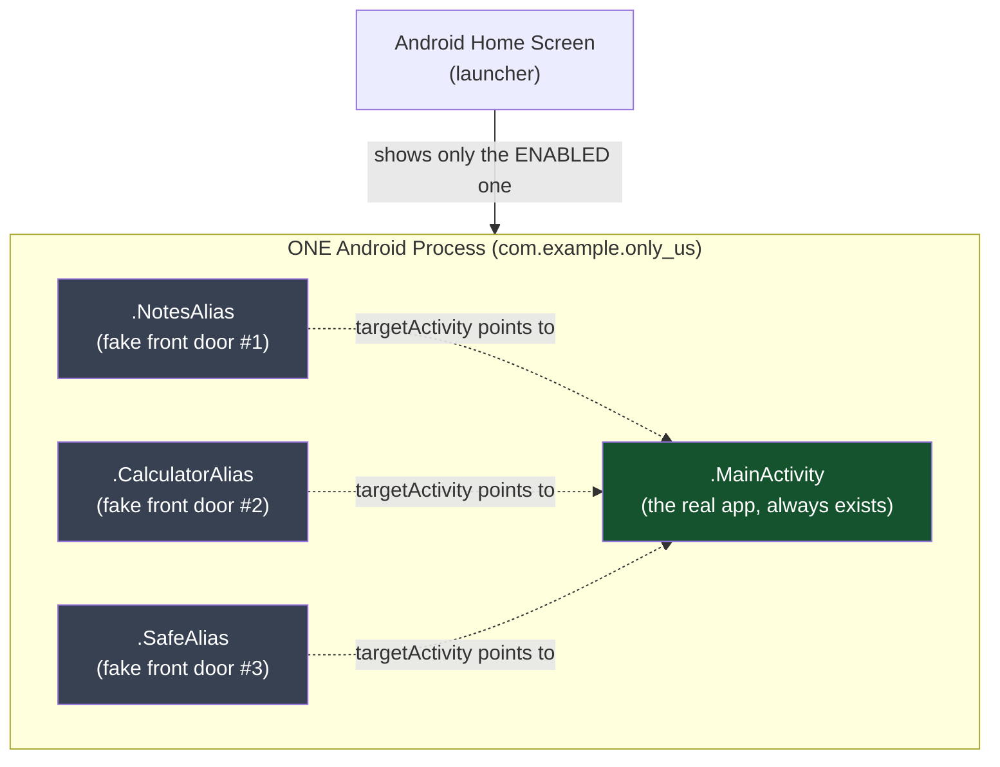

**What's really happening:** There is only ever *one* real screen/app (`MainActivity`). The "aliases" are just alternate **front doors** with different names/icons that all lead to the same house. Your `AppDisguiseManager.kt` doesn't create new apps — it just flips a switch (`setComponentEnabledSetting`) telling the Android launcher which front door to display.

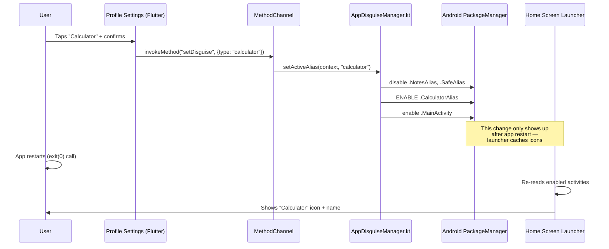

This also explains **why you needed the restart** — the Android home screen launcher caches the list of visible icons and doesn't re-scan until the app is relaunched from scratch.

**iOS has no equivalent to this.** Apple doesn't allow apps to dynamically change their home-screen name/icon via arbitrary code (there's a very limited "Alternate App Icons" API, but it can't change the *name*, and requires Apple-approved icon assets bundled at build time — no user-picked custom images). This is a genuine Android-only capability in your app.

---

## 8. How Your App Actually Affects RAM (Memory) in Practice

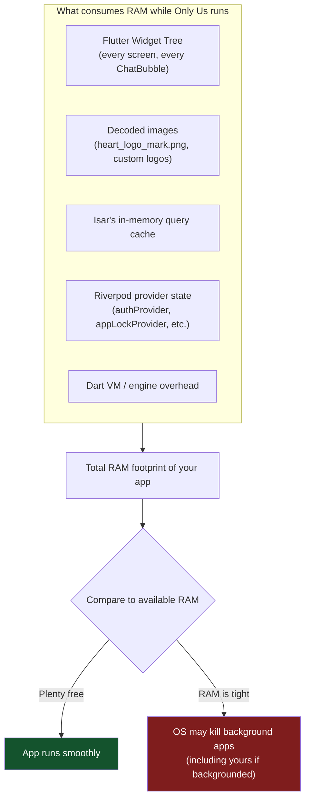

**Concrete example in your codebase:** Every time `ChatScreen` builds its `ListView` of messages, each `ChatBubble` widget consumes a small amount of RAM. If you had 10,000 messages and rendered them all at once (not lazily), RAM usage would spike. This is why Flutter's `ListView.builder` (lazy — only builds visible items) matters over a plain `ListView` (builds everything upfront) for anything that could grow large, like a chat history.

**Images are a common RAM killer:** A photo picked via `image_picker` might be a 4000x3000 pixel JPEG (12+ million pixels). If displayed at full resolution in a 300x300 avatar circle, Flutter still often decodes the *original* size into RAM unless you explicitly downsample — that's megabytes of RAM for something the user sees as a tiny circle. (Not an issue yet in Only Us since you only picked one custom logo at a time, but worth knowing before adding photo messages.)

---

## 9. Android vs iOS — Summary Comparison Table

| Concept | Android | iOS |
|---|---|---|
| Process model | Each app = Linux process, can be killed anytime for RAM | Similar, but apps get "Suspended" (frozen) before being killed |
| App unit of UI | Activity (one Activity = ~one screen) | ViewController (roughly equivalent) |
| Storage sandbox | `/data/data/<package>/` — private; also has *shared* external storage | `Containers/Data/Application/<uuid>/` — always fully private, no shared storage concept |
| Manifest file | `AndroidManifest.xml` | `Info.plist` |
| Permission model | Install-time (normal) + runtime (dangerous) popups | All sensitive permissions are runtime, with mandatory usage-description strings or the app crashes |
| Background execution | More lenient historically, though modern Android restricts it too (Doze mode, battery optimization) | Very strict — background tasks must use specific APIs (Background Tasks framework, silent push, etc.) |
| Changing home-screen name/icon | Possible via activity-alias (what you just built!) | Not possible for arbitrary user-picked names; only pre-bundled "Alternate Icons," no name change |
| Secure credential storage | Android Keystore (used under the hood by `flutter_secure_storage`) | iOS Keychain (used under the hood by `flutter_secure_storage`) |
| Local database options | SQLite, Isar, Hive, Room (native) | SQLite, Isar, Hive, Core Data (native) — same Flutter packages work on both since Isar wraps SQLite-like storage per-platform |

---

## 10. Putting It All Together — Your App's Full Data Flow

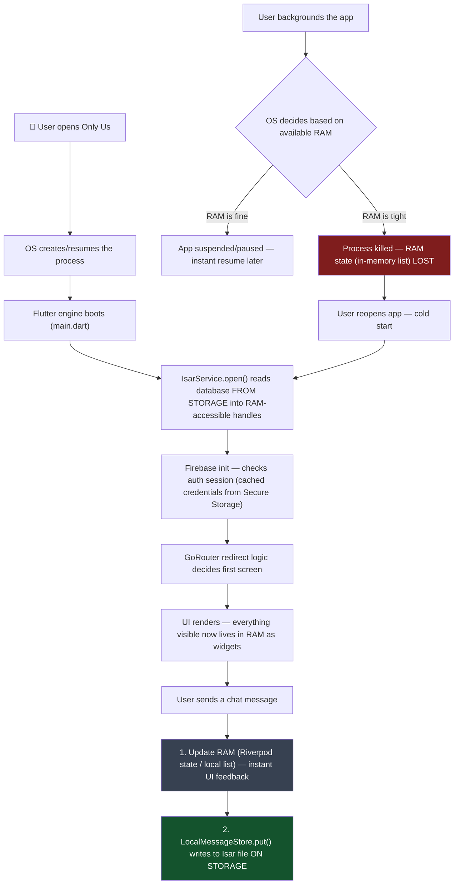

**The one sentence that ties this whole guide together:** *Anything only in RAM disappears the moment the OS decides it needs that memory back — which can happen at any time, for reasons outside your control — so anything that matters must be explicitly written to storage, and your job as a mobile developer is deciding exactly which data needs that guarantee.*

---

## Glossary (Quick Reference)

- **Process** — a running instance of your app that the OS tracks and can kill
- **RAM (Random Access Memory)** — fast, temporary memory; wiped when the process dies
- **Storage / Disk / Flash Storage** — slower, permanent memory; survives restarts and force-closes
- **Sandbox** — the isolated private area (both storage and process) the OS gives each app so it can't interfere with others
- **Cache** — a storage subfolder the OS is allowed to delete automatically without warning
- **Persistent storage** — storage the OS will never delete on its own (only on uninstall/manual clear)
- **Permission** — explicit user grant required before your app can access sensitive data/hardware
- **Activity (Android)** / **ViewController (iOS)** — the unit representing one screen/UI context
- **Activity-alias (Android only)** — an alternate "front door" pointing to the same Activity, used for your app disguise feature
- **Cold start** — launching an app from a fully-killed state (must reload everything from storage)
- **Warm start / resume** — returning to a suspended/backgrounded app (much faster, RAM state intact)
