# Becoming an Expert Mobile Developer — Performance, UX & Architecture

A structured path from beginner → intermediate → advanced, covering everything that separates a "works on my phone" app from a production app used by millions (Instagram, WhatsApp, Spotify, etc.). Every concept includes a Mermaid diagram, a real popular-app example, and how it maps to your **Only Us** codebase where relevant.

---

# PART A — BEGINNER LEVEL

## A1. The Golden Rule: Build Off the Main Thread

Every mobile OS has ONE thread responsible for drawing pixels and responding to touches — the **Main/UI thread**. If you do slow work there (network calls, heavy computation, big loops), the screen **freezes** — this is what causes "App Not Responding" (Android) or the classic **jank/stutter**.

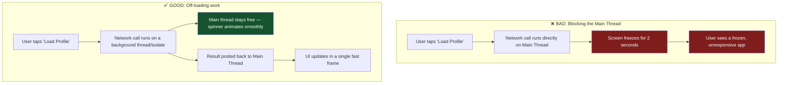

**Real example — Instagram:** When you pull-to-refresh your feed, Instagram shows a smooth spinner while the network request and JSON parsing happen entirely off the main thread. If Instagram did this synchronously, every refresh would freeze your screen for however long the network takes.

**In Flutter (your stack):** Flutter's `async`/`await` with `Future`s automatically keeps I/O (network, file reads) off the main thread's *hot path* using the event loop. But **CPU-heavy** work (like decoding a huge image, parsing a massive JSON, or a heavy loop) still blocks the UI unless you explicitly move it to a separate **Isolate** using `compute()`.

```dart
// BAD - blocks UI if the JSON is large
final data = jsonDecode(hugeJsonString);

// GOOD - runs on a separate isolate, UI stays smooth
final data = await compute(jsonDecode, hugeJsonString);
```

---

## A2. Frame Budget — Why "60fps" Actually Matters

Phones redraw the screen 60 (or 90/120) times per second. Each frame has a strict time budget.

```mermaid
gantt
    dateFormat X
    axisFormat %L ms
    title One Frame's Time Budget at 60fps (16.6ms total)
    section Frame
    Layout & Build       :0, 6
    Paint                :6, 12
    Compositing/GPU      :12, 16
    Idle (frame delivered):16, 17
```

If your code takes **longer than 16.6ms** to produce a frame, that frame is dropped — the user perceives this as a stutter ("jank"). Do this repeatedly and the whole app feels laggy, even if it's technically "working."

**Real example — Spotify's now-playing screen:** The album art blur/gradient animation as you scroll must complete well under 16ms per frame, or the smooth "parallax" effect breaks and looks choppy. Spotify's engineers profile this specific screen constantly because it's the most-viewed screen in the app.

**Tooling:** Both platforms give you frame-timing tools — Android Studio's **Profiler** (GPU rendering) and Xcode's **Instruments** (Core Animation). In Flutter, run `flutter run --profile` and use the **Performance Overlay** (`showPerformanceOverlay: true` on `MaterialApp`) — two colored bars appear; if either bar's graph spikes above the middle line, you're dropping frames.

---

## A3. Widget/View Rebuilds — The Root of Most Jank

Every time state changes, the framework re-evaluates what needs to be redrawn. **Rebuilding more than necessary is the #1 beginner performance mistake** in Flutter, SwiftUI, and Jetpack Compose alike (all three use a "declarative" model where this problem looks the same).

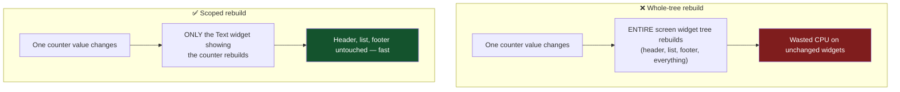

**In your Only Us app:** Look at `chat_screen.dart` — when a new message arrives, you want ONLY the `ListView` (or ideally just the new `ChatBubble`) to rebuild, not the entire `Scaffold` including the `_ChatHeader`. Riverpod helps here: `ref.watch(someProvider)` inside a small `Consumer` widget scopes the rebuild to just that widget, instead of watching at the top of a giant `build()` method.

**Real example — WhatsApp:** When a typing indicator appears in a chat, WhatsApp doesn't rebuild the entire message list — only the small "typing..." bubble at the bottom updates. This is why you can be mid-scroll through months-old messages and the typing indicator updates instantly without your scroll position jumping.

---

## A4. Lazy Lists — Never Build What Isn't Visible

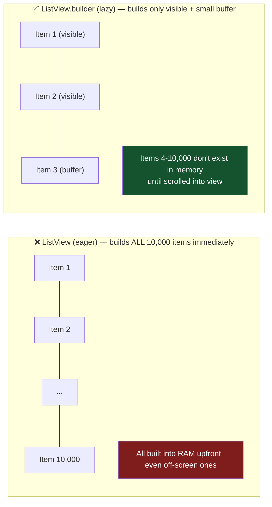

**Real example — Twitter/X's timeline:** With potentially millions of tweets in your history, Twitter never keeps them all in memory. It uses a windowed/lazy list (RecyclerView on Android under the hood) that recycles view objects as you scroll — old off-screen tweet views get their content swapped for new content rather than creating brand-new views every scroll.

**Your app already does this correctly** — `chat_screen.dart`'s message list uses `ListView.builder`, which is the right call, especially once conversations grow to hundreds of messages.

---

## A5. Understanding Widget Keys (Beginner Gotcha)

When list items get reordered, added, or removed, the framework needs to know "is this the *same* logical item that moved, or a *new* item?" Without a `Key`, Flutter (and Compose, and SwiftUI) can get this wrong and either lose state or do unnecessary rebuilds.

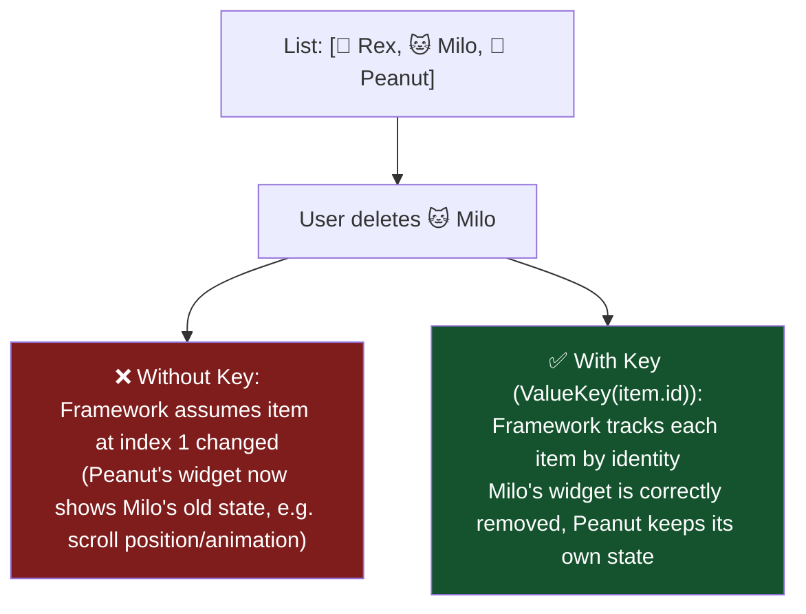

**Real-world impact:** Without proper keys, a "swipe to delete" animation on a list (like Gmail's swipe-to-archive) can visually glitch — the wrong row animates away, or expanded/collapsed states jump to the wrong item after a delete.

---

# PART B — INTERMEDIATE LEVEL

## B1. Memory Leaks — The Silent RAM Killer

A memory leak happens when your app keeps a reference to something it no longer needs, so the OS can't reclaim that RAM even though it's logically "done."


**This is exactly why your `analysis_options.yaml` enforces `cancel_subscriptions` and `close_sinks` lints** (see your project's `CLAUDE.md` §4) — these catch exactly this class of bug at compile-review time rather than letting the app slowly balloon in RAM usage during a long session.

**Real example — a common bug pattern in production apps:** A chat app subscribes to a "user is typing" WebSocket stream when you open a conversation. If closing the conversation doesn't unsubscribe, and you open/close 50 different conversations during one app session, you can end up with 50 active listeners all still firing — RAM usage climbs, and worse, all 50 might try to update UI that no longer exists, causing crashes.

## B2. Image Memory — Decoded Size vs File Size (Critical & Often Missed)

This is one of the most common causes of high RAM usage and out-of-memory (OOM) crashes.

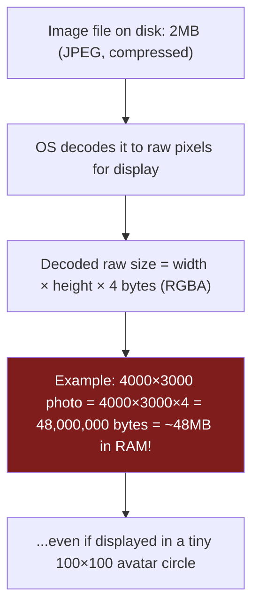

**The fix — always decode at target size, never full resolution:**

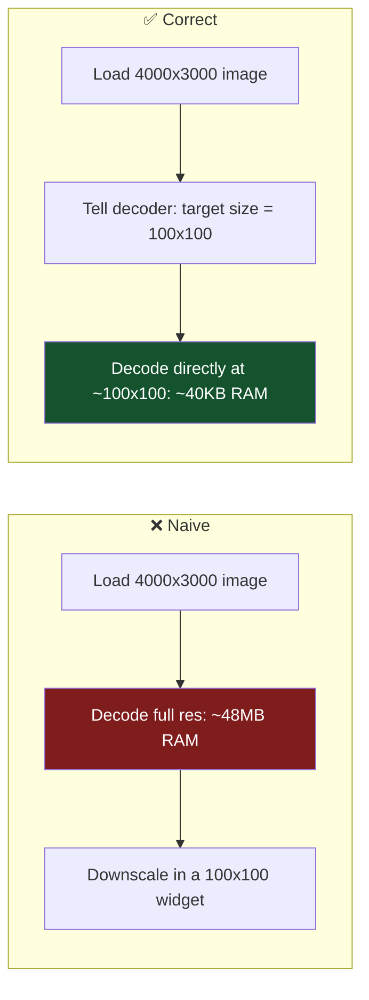

**Real example — Instagram/Pinterest's grid views:** These apps request appropriately-sized *thumbnails* from their CDN (e.g., a 300px version) for grid views, rather than downloading and decoding the full 4000px original just to shrink it visually. This alone is why scrolling through hundreds of images in these apps doesn't crash your phone.

**In Flutter:** Use `Image.network(url, cacheWidth: 300)` or `ResizeImage` to tell the decoder the target size *before* decoding, not after. Your `Image.asset('assets/images/heart_logo_mark.png')` calls in `brand_mark.dart` are small fixed assets so this isn't urgent yet — but the moment you add user-uploaded photo messages (on your roadmap), this becomes critical, since a user might send a 12MP photo that gets displayed as a small chat thumbnail.

## B3. Caching Strategy — The Three-Tier Model

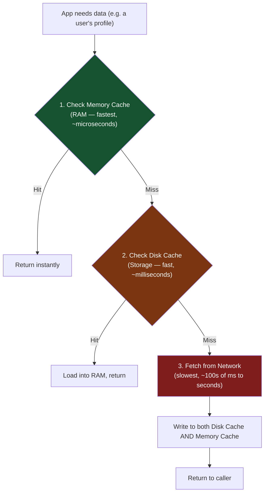

**Real example — Spotify's offline mode:** Songs you've played recently are memory-cached (instant replay), previously-downloaded songs are disk-cached (works offline, slightly slower to start), and anything new streams from network. This exact 3-tier model is why Spotify feels instant for recently-played tracks but takes a moment for something brand new.

**This directly maps to your app's architecture:** Your `CachedUserProfile` (Isar) is the **disk cache tier** — it exists so the profile screen has something to show without a network round trip. If you added a Riverpod provider that also memoizes the currently-logged-in user in RAM (which you already effectively get via `currentUserProvider`), that's your **memory tier**. The 3-tier pattern is already partially present in your codebase — worth recognizing it as a deliberate pattern, not an accident.

## B4. Network Efficiency — Batching & Debouncing

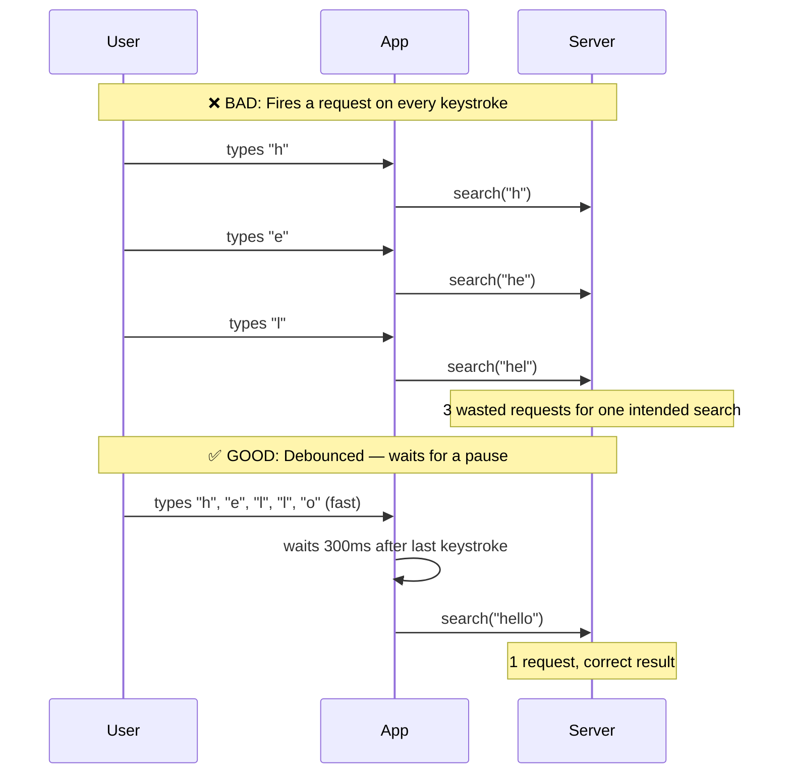

**Real example — every search bar you've ever used** (Google, Amazon, Instagram's search) debounces input. Without it, typing "hello" would fire 5 separate network requests, wasting battery, data, and server load — and often showing flickering, out-of-order results as slower earlier requests resolve after faster later ones.

## B5. State Management — Why It's Not Just "Where Do Variables Live"

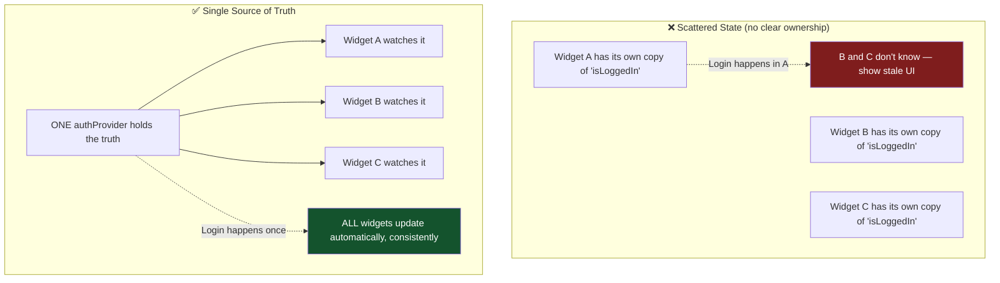

**This is exactly the architectural improvement you made with GoRouter + Riverpod in Only Us.** Before, login success required *manually* telling the navigator to push `/home` from inside the login screen. After, `authProvider` is the single source of truth, and the router's `redirect` callback — along with any other widget watching `authProvider` — reacts automatically and consistently. This eliminates an entire class of bugs where one part of the UI updates but another part (that forgot to also handle the state change) doesn't.

**Real example — Twitter's like button:** Tap "like" on a tweet in your timeline, and the like count updates *everywhere that tweet appears* — the timeline, the tweet detail view, your profile's "liked tweets" tab — instantly and consistently, because all of them observe the same underlying state rather than each maintaining an independent copy.

---

# PART C — ADVANCED LEVEL

## C1. The Rendering Pipeline — What Actually Happens Per Frame

Understanding this deeply lets you diagnose *why* something is slow, not just *that* it's slow.

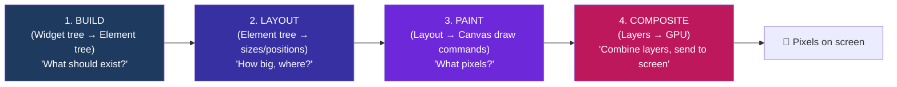

Each stage can be a bottleneck for different reasons:
- **Build is slow** → too many widgets rebuild unnecessarily (see A3/B1)
- **Layout is slow** → deeply nested constraint-dependent widgets (e.g. `IntrinsicHeight`, which must measure children twice)
- **Paint is slow** → complex custom painting, too many `Opacity`/`ClipRect` layers (each forces a new compositing layer)
- **Composite is slow** → too many separate GPU layers, or expensive blur/shadow effects

**Real example — why `Opacity` is a known Flutter performance trap:** Wrapping a widget in `Opacity` forces it onto its own compositing layer if the value isn't 0 or 1, which is expensive if that widget rebuilds frequently (like something animating). The fix used by production apps: `AnimatedOpacity` with `RepaintBoundary`, or pre-baking opacity into the color values directly when possible, avoiding the extra layer entirely.

## C2. Garbage Collection — How "Automatic" Memory Management Actually Works

Dart (Flutter), Kotlin/Java (Android), and Swift (iOS) all avoid manual memory management, but through **different mechanisms** — worth knowing because it changes how leaks manifest.

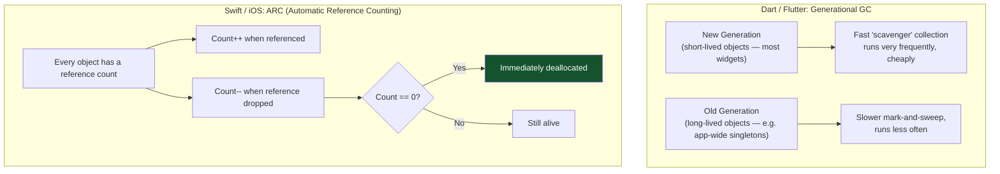

**The critical difference this creates:** Dart/Java's GC can cause occasional **GC pauses** (a brief freeze while it cleans up) — usually imperceptible, but under memory pressure can cause jank. Swift's ARC has **no pause** (it's deterministic, deallocating exactly when the count hits zero) — but introduces a different bug class entirely: **retain cycles**, where two objects reference each other and neither's count ever reaches zero, leaking forever (Swift's `weak`/`unowned` keywords exist specifically to break these cycles).

**Real example — a classic iOS retain cycle:** A `ViewController` holds a closure (e.g. a network callback) that captures `self` strongly, and that closure is stored *inside* a property owned by `self`. Neither can ever be freed — this is such a common bug that Swift style guides universally recommend `[weak self]` in closures stored as properties.

## C3. Startup Time Optimization — Cold Start, Warm Start, Hot Start

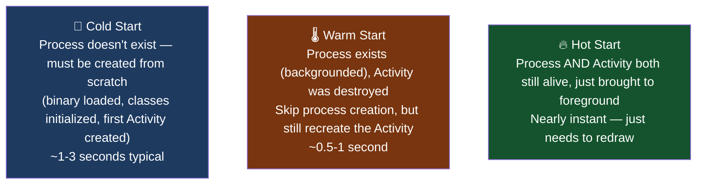

**Where the time actually goes on a cold start** (this is what your `splash_screen.dart` exists to mask gracefully):

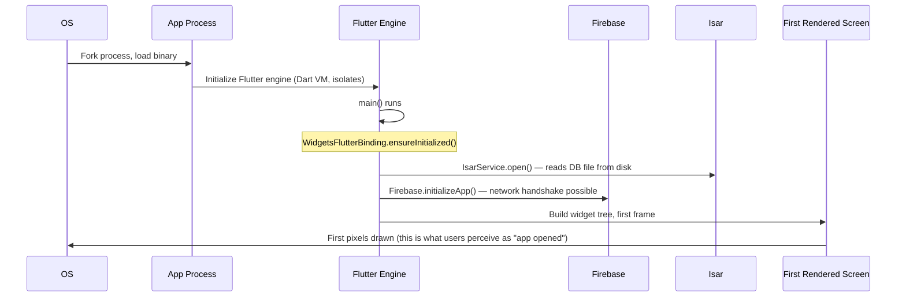

**Real example — why big apps show a splash screen at all:** Uber, Instagram, and your Only Us app all show a branded splash screen during this window rather than a blank white screen, because the *actual* work (Firebase init, database opening, auth token validation) takes a non-zero, sometimes-unpredictable amount of time, and a branded screen feels intentional while a blank flash feels broken.

**Advanced optimization — deferred/lazy initialization:** Production apps at scale often *delay* non-critical initialization (like analytics SDKs, or ad network SDKs) until after the first frame is drawn, specifically so cold-start time — a metric app stores literally rank apps by — stays as low as possible. Only initialize on the critical path what's truly needed to render screen #1.

## C4. The "Overdraw" Problem — Painting Pixels Nobody Sees

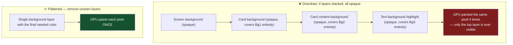

**How to detect it:** Android Studio has a literal "Debug GPU Overdraw" visual overlay that colors your screen based on how many times each pixel was painted (blue = 1x, green = 2x, pink = 3x, red = 4x+ — red means real trouble). iOS's Instruments has a similar "Color Blended Layers" debug option in the Simulator.

**Real example — a common mistake in list-heavy apps (e.g. e-commerce apps like Amazon):** Giving every list item's root `Container` a background color, AND its inner card another background color, AND a nested content wrapper another — when only the innermost color is ever visible — causes measurable overdraw at scale across a long scrolling list, hurting battery life and frame rate on lower-end devices even if it's invisible on a high-end test device.

## C5. Battery & Background Work — The Real Constraint Behind "RAM"

RAM usage and battery usage are related but distinct. A background service that wakes the CPU every 10 seconds to check for something can drain battery dramatically even with modest RAM usage.

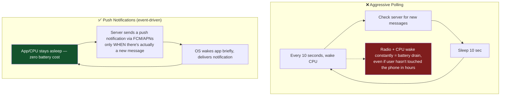

**Real example — WhatsApp/iMessage message delivery:** Neither app polls a server every few seconds asking "any new messages?" — that would be a battery disaster at scale. Both rely on **push notification infrastructure** (Firebase Cloud Messaging on Android, Apple Push Notification service on iOS) where the OS itself maintains one persistent, battery-efficient connection to deliver a "wake up, you have something" signal, and the app only does work in response to that signal.

**Relevant to your roadmap:** When you eventually build real messaging for Only Us (currently demo-only, per your README), this is the pattern to use — Firebase Cloud Messaging (which you already have as a dependency: `firebase_core`) rather than an in-app polling timer, specifically to avoid draining the user's battery just for message delivery.

## C6. Platform Channels — The Bridge You Already Built

Your **App Disguise** feature is a genuine advanced-level pattern — bridging Dart code to native platform APIs that Flutter doesn't expose by default.

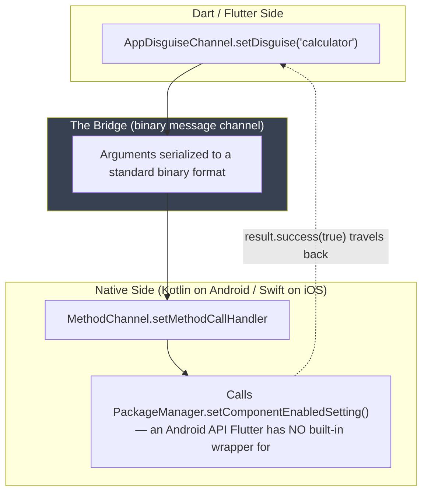

**Why this matters at the expert level:** Every cross-platform framework (Flutter, React Native, even web-based Capacitor/Cordova apps) is fundamentally limited to whatever the framework team has chosen to wrap. The moment you need something framework-agnostic — like your activity-alias switching, or biometric-specific edge cases, or a niche native SDK — you *must* understand platform channels (Flutter), Native Modules (React Native), or their equivalents. This is genuinely one of the more advanced skills in mobile dev, and you've already built a working example of it.

## C7. Testing Pyramid — Why Your Project Enforces 90% Coverage

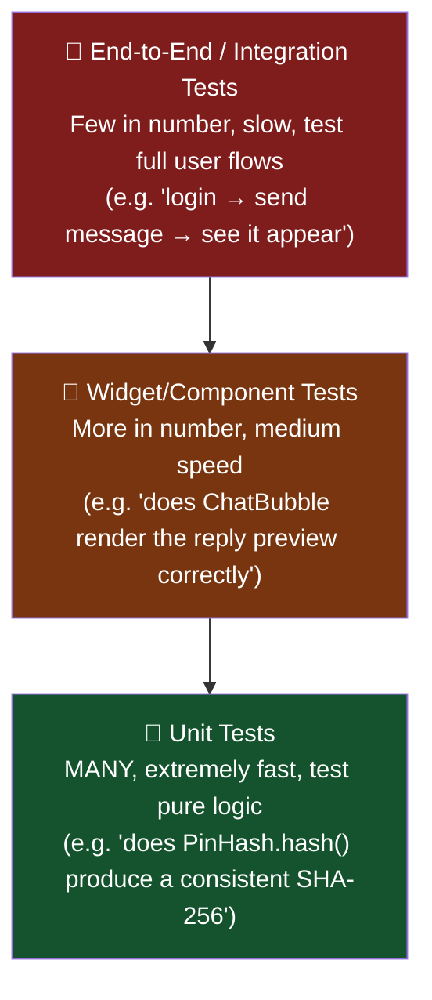

**Why the pyramid shape, not a rectangle:** E2E tests are slow (seconds each) and brittle (a UI tweak can break them even if logic is correct) — so you want *few*. Unit tests are milliseconds each and test one thing in isolation — so you want *many*. Getting this balance backwards ("test everything end-to-end") is a common mistake that makes CI pipelines take 40 minutes instead of 3.

**Real example — why your project's `CLAUDE.md` mandates `mocktail` for every repository/datasource:** Production teams at companies like Google and Meta enforce this exact pattern — a `usecase` test should never make a real network call or touch a real database, because that test would then fail for reasons unrelated to the code being tested (network flakiness, a test database being in a weird state), destroying trust in the test suite over time.

---

# PART D — PUTTING IT ALL TOGETHER: A "Best Practices Checklist"

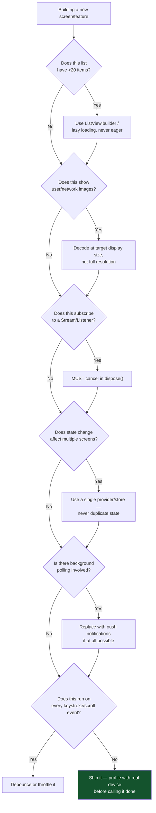

---

## Appendix: Where Only Us Already Applies These Patterns

| Pattern | Status in Only Us | File |
|---|---|---|
| Lazy lists | ✅ Done | `chat_screen.dart` uses `ListView.builder` |
| Single source of truth (auth state) | ✅ Done | `authProvider` + GoRouter redirect |
| Persistent storage for critical data | ✅ Done | `LocalMessageStore` / Isar |
| Disk-tier caching | ✅ Done | `CachedUserProfile` |
| Secure credential storage | ✅ Done | `flutter_secure_storage` for PIN hash |
| Cancel subscriptions/close sinks | ✅ Enforced by lint | `analysis_options.yaml` |
| Platform channel for native-only API | ✅ Done | `AppDisguiseChannel` + `AppDisguiseManager.kt` |
| Image decode-at-size | ⚠️ Not yet critical | Only fixed small assets so far; **revisit when adding photo messages** |
| Debounced search/input | ⚠️ N/A yet | No search feature yet — apply this pattern if one is added |
| Push notifications instead of polling | ⚠️ Roadmap item | Real messaging is still demo-only; use FCM when built |
| Widget rebuild scoping (small `Consumer`s) | ⚠️ Worth auditing | Check `chat_screen.dart` for over-broad `ref.watch` at top of `build()` |

---

## Glossary (Advanced Terms Used Above)

- **Jank** — a visibly dropped/delayed frame, perceived as stutter
- **Isolate (Dart)** — a separate memory heap + thread Dart can run code on, avoiding blocking the main isolate
- **Compositing layer** — a separate GPU-managed surface; more layers = more GPU work, but sometimes necessary for smooth animation
- **Retain cycle (Swift/ARC)** — two objects holding strong references to each other, preventing either from ever being freed
- **Generational GC** — a garbage collector strategy that treats new (likely short-lived) and old (likely long-lived) objects differently for efficiency
- **Debounce** — delay acting until input has paused for a set time (e.g. 300ms after last keystroke)
- **Throttle** — limit how often an action can fire, regardless of how often it's triggered (different from debounce — throttle still fires periodically during continuous input)
- **Overdraw** — painting the same pixel more than once per frame, wasting GPU work
- **Cold/Warm/Hot start** — the three levels of "how much has to be recreated" when a user opens an app
- **Push notification (FCM/APNs)** — event-driven server-to-device messaging, avoiding battery-draining polling
